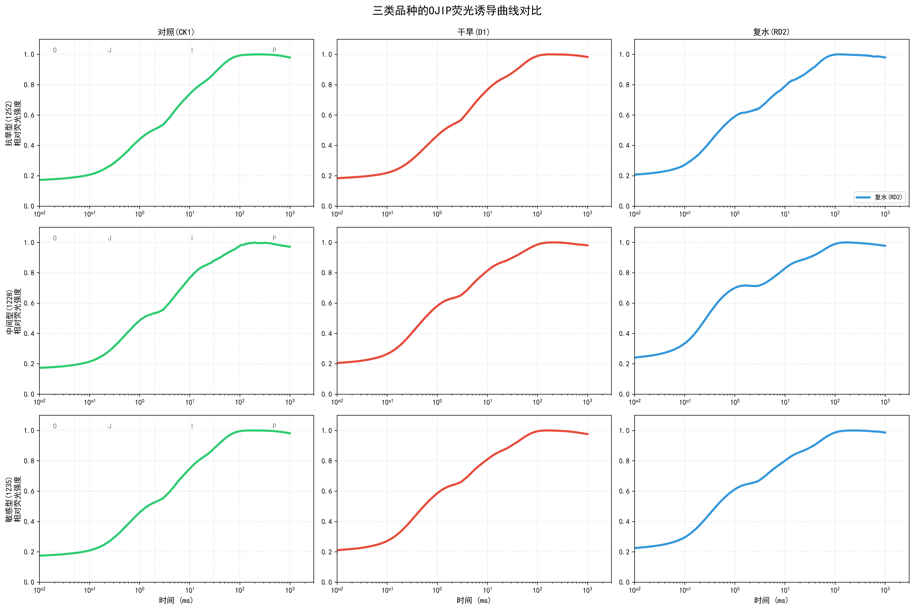
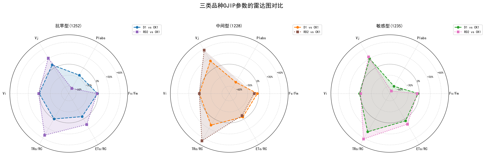
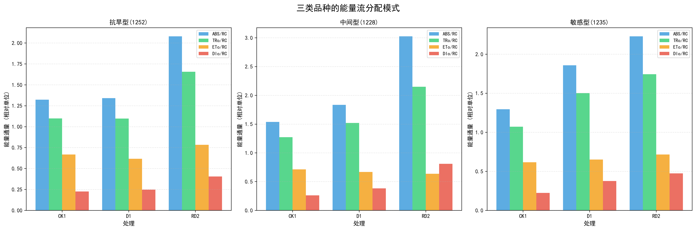

# 第3章 水稻抗旱性评价与多源光谱响应特征研究

## 3.1 引言

水稻对干旱胁迫的响应是一个涉及形态、生理和分子层面的复杂过程。Farooq et al. (2009) 系统综述了植物干旱胁迫的效应与调控机制，指出干旱胁迫在形态层面导致叶片卷曲、面积减小和生长受抑，在生理层面引起叶片相对含水量下降、叶绿素降解和光合效率降低，在分子层面则激活一系列抗逆基因表达和代谢途径调控。这些多层面的响应为基于表型的抗旱性评价提供了丰富的信息来源，同时也对评价方法的全面性提出了更高要求。

传统的抗旱性评价方法主要依赖于形态和生理指标的测定。Blum (2011) 在其专著《干旱环境下的作物育种》中系统论述了抗旱育种的生理学基础，指出叶片相对含水量（Relative Water Content，RWC）和细胞膜稳定性是衡量植物水分状态和耐脱水能力的"金标准"，为抗旱种质筛选提供了可靠的生理依据。然而，Araus & Cairns (2014) 在评述田间高通量表型技术时指出，传统方法通常需要破坏性取样或耗时的人工测量，单一技术人员每天仅能处理数十个样本，难以满足现代育种对大规模种质资源高通量筛选的需求。

近年来，多源数据融合的理念在作物表型研究中受到广泛关注。Feng et al. (2024) 综合利用RGB图像、热红外和多光谱数据对番茄水分胁迫进行评估，发现多源融合模型的预测精度较单一模态提升15%~25%，证实了不同传感器数据之间的协同增益。在干旱胁迫研究领域，反射光谱主要捕获叶片色素含量和水分状态等"结构性"信息，静态荧光反映细胞壁酚类化合物积累等"次生代谢"信息，而OJIP荧光动力学则直接探测光合电子传递链的"功能性"信息。这三类信息分别对应植物干旱响应的不同生理层面，理论上具有高度互补性。但现有研究多关注单一的光谱或荧光模态，缺乏对OJIP光合动力学与多光谱反射、静态荧光的系统性整合研究，尤其是在品种抗旱性评价这一特定应用场景下，多源光谱融合的潜力尚未得到充分挖掘。

光谱技术为无损、快速获取植物生理状态信息提供了新途径。Murchie & Lawson (2013) 系统回顾了叶绿素荧光分析技术在植物生理研究中的应用，详细阐述了荧光参数与光合电子传递链功能状态的对应关系，证实了荧光技术在探测植物早期生理胁迫方面的独特优势——能够在形态变化出现之前捕捉到光合机构的功能异常。与此同时，不同波段的反射光谱携带着色素含量（可见光区）和水分结构（近红外区）的丰富信息。但现有研究多局限于单一光谱模态，难以全面捕捉植物对干旱胁迫的复杂响应。

与此同时，在样本量有限的科研场景下，多源融合面临着方法学层面的挑战。作物抗旱性评价实验通常受限于品种数量、重复次数和实验周期，样本量往往仅有数十至百余个。在这一"小样本"条件下，传统的统计方法（如多元回归、偏最小二乘回归）可能因特征维度与样本量之比过高而出现过拟合风险，而深度学习方法则因训练数据不足而难以发挥优势。这一矛盾在多源融合场景下尤为突出：融合37个特征（19 Multi + 10 Static + 8 OJIP）后，特征维度与样本量的比值进一步升高，对模型的泛化能力提出了更高要求。因此，在构建多源融合预测模型之前，有必要首先验证各模态特征的生理学意义和互补性，为后续模型选择和特征工程提供理论指导。

鉴于此，本章旨在整合多光谱反射、静态荧光和OJIP荧光动力学三种模态，系统揭示水稻在干旱胁迫下的多源光谱响应特征。具体研究内容包括：（1）建立基于双维度PCA-隶属函数法的抗旱性综合评价体系，同时考虑胁迫响应能力和复水恢复效率，为后续章节提供可靠的抗旱性"标签"（即 $D_{\text{conv}}$ 值）；（2）分析干旱胁迫下生理指标和光谱特征的变化规律，从生理学角度阐明各模态特征的胁迫响应机制；（3）验证三种光谱模态的互补性，从信息论角度论证多源融合的必要性。本章的研究成果将为第4章的多源融合建模提供两方面的基础支撑：一是经过生理学验证的37个融合特征作为模型输入，二是基于双维度评价体系的 $D_{\text{conv}}$ 值作为模型预测目标。

---

## 3.2 材料与方法

### 3.2.1 供试水稻种质资源

本研究选用13个籼稻（*Oryza sativa* L. subsp. *indica*）品种作为供试材料，均来自华南农业大学水稻遗传育种实验室种质资源库。供试品种涵盖了华南稻区的主栽品种及部分高代育种材料，品种编号包括：12、73、1099、1110、1210、1214、1218、1219、1228、1235、1252、1257、1274。前期田间观察和初步筛选表明，这些品种在干旱胁迫下的表型响应存在明显差异，涵盖了从高度抗旱到极度敏感的连续梯度，适合用于抗旱性评价方法的建立和验证。品种间遗传背景具有广泛的多样性，来源于不同的育种系谱，能够代表华南籼稻种质资源的抗旱性变异范围。13个品种的样本量在保证统计分析可靠性的同时，兼顾了盆栽实验的可操作性。

栽培管理方面，供试种子经10%次氯酸钠溶液消毒15 min后，于28°C恒温培养箱中催芽48 h。催芽后的种子播于育秧盘中，待秧苗长至三叶一心期（播种后约21天）时移栽至塑料盆钵（直径20 cm，高25 cm，底部设排水孔）。每盆装入经风干过筛的水稻土约3.5 kg（土壤类型为潴育型水稻土，有机质含量2.8%，pH 5.6），每盆移栽3株，移栽后保持浅水层（2~3 cm）缓苗7天。基肥施用复合肥（N:P₂O₅:K₂O = 15:15:15）2.0 g/盆，分蘖期追施尿素0.5 g/盆。移栽后正常灌溉管理至分蘖盛期（移栽后约30天），随后开始干旱胁迫处理。

所有光谱和生理指标的测定均以功能叶（倒二叶）为对象。倒二叶是水稻营养生长期光合贡献最大的叶片，其生理状态能够代表植株整体的光合能力和胁迫响应水平（Murchie & Lawson, 2013），因此被选为统一的测定对象。取样时选取各处理组中生长均匀、无病虫害的植株，每个生物学重复取3株的倒二叶进行测量。所有测量在上午9:00~11:00完成，以避免午间高温和光抑制对荧光参数的干扰。

### 3.2.2 干旱胁迫处理方案

实验在华南农业大学人工气候室条件下进行，环境因子严格控制如下：温度28±2°C（昼）/24±2°C（夜），光照强度300 μmol·m⁻²·s⁻¹，光周期14 h/10 h（昼/夜），相对湿度60%~70%，光源采用LED植物生长灯（红蓝光比例为4:1）。盆栽基质采用华南农业大学教学实验农场的潴育型水稻土，经风干、粉碎、过2 mm筛后装盆，土壤基本理化性质为：容重1.15 g·cm⁻³，田间持水量（Field Capacity，FC）为32.5%（质量含水量），有机质含量2.8%，全氮0.18%，速效磷12.5 mg·kg⁻¹，速效钾85.3 mg·kg⁻¹，pH 5.6；田间持水量采用环刀法（LY/T 1215-1999）测定，每批土壤测定3次取平均值。

采用盆栽控水法进行干旱胁迫处理，实验设计如表3-1所示。正常灌溉对照（CK1）与干旱胁迫处理（D1）在同一时期（T1）进行测量，可直接进行对照比较；复水恢复处理（RD2）是在D1处理后复水7天再进行测量，由于无同期对照组，只能计算相对于D1的恢复程度。这一实验设计的特殊性决定了后续双维度评价体系的构建逻辑。

**表3-1 干旱胁迫处理实验设计**

| 处理代号 | 处理名称 | 测量时期 | 土壤相对含水量 | 处理说明 |
|:--------:|:---------|:--------:|:--------------:|:---------|
| CK1 | 正常灌溉对照 | T1 | >80% | 全生育期正常灌溉 |
| D1 | 干旱胁迫 | T1 | 30%-40% | 自然干旱至土壤含水量降至目标范围 |
| RD2 | 复水恢复 | T2 | >80% | D1处理后复水至正常灌溉7天 |

每个品种每个处理设置3次生物学重复，共计13个品种×3个处理×3次重复=117个样本。

干旱胁迫采用自然干旱法实施：停止灌溉后，通过称重法每日监测土壤含水量变化，每日上午8:00对所有盆钵称重，根据盆钵总重与干土重、盆重的差值计算土壤质量含水量，再换算为相对含水量（土壤质量含水量/田间持水量×100%）。当土壤相对含水量降至30%~40%范围时，开始进行光谱和生理指标的测量。Farooq et al. (2009) 指出，土壤相对含水量降至田间持水量的30%~40%时，水稻叶片水势降至-1.5~-2.0 MPa，气孔导度下降50%以上，光合速率显著受抑，属于中度至重度干旱胁迫范围；这一胁迫强度既能诱导显著的品种间差异，又不至于导致植株死亡，适合用于抗旱性评价。从停止灌溉至达到目标含水量，自然干旱过程持续约7~10天，具体时间因品种和环境条件略有差异。D1处理测量完成后，立即对所有干旱处理盆钵恢复正常灌溉，保持2~3 cm浅水层，复水后第7天（T2时期）进行RD2处理的光谱和生理指标测量。Xu et al. (2010) 的研究表明，水稻在复水后5~7天内完成主要的生理恢复过程，包括气孔重新开放、光合速率恢复和新叶展开，7天的恢复期能够充分反映品种间复水响应能力的差异。

### 3.2.3 生理指标测定方法

选取5个与抗旱性密切相关的生理指标进行测定，所有指标均为正向指标，即数值越高表示生长状态越好。株高、叶面积、叶长和叶宽是反映水稻营养生长状态的核心形态指标，能够直观表征干旱胁迫对植株生长发育的抑制程度；SPAD值作为叶绿素相对含量的无损估测指标，与叶片光合能力密切相关。相较于叶片相对含水量（RWC）、脯氨酸含量等需要破坏性取样的生理生化指标，本研究选用的5个指标均可通过无损或微损方式快速测定，与光谱数据的无损采集理念一致，且能够在同一叶片上实现多指标的同步测量，避免了取样差异带来的误差。每个样本测量3株取平均值，测量时间统一在上午9:00~11:00进行，以减少日变化的影响。测定方法详见表3-2。

**表3-2 生理指标测定方法**

| 指标    | 英文名          | 单位  | 测定方法          | 仪器/工具                           |
| :---- | :----------- | :-: | :------------ | :------------------------------ |
| 株高    | Plant height | cm  | 从土表至最高叶尖的垂直距离 | 钢卷尺（精度1 mm）                     |
| 叶面积   | Leaf area    | cm² | 功能叶（倒二叶）面积测定  | LI-3000C叶面积仪（LI-COR，美国）         |
| 叶长    | Leaf length  | cm  | 功能叶叶枕至叶尖的长度   | 钢卷尺（精度1 mm）                     |
| 叶宽    | Leaf width   | cm  | 功能叶最宽处的宽度     | 游标卡尺（精度0.1 mm）                  |
| SPAD值 | SPAD         |  —  | 叶绿素相对含量       | SPAD-502叶绿素仪（Konica Minolta，日本） |

各指标的测定方法如下。株高采用钢卷尺（精度1 mm）测定，记录从土表至最高叶尖的垂直距离；叶面积使用LI-3000C便携式叶面积仪（LI-COR Biosciences，美国）测定，该仪器基于光电扫描原理实现非破坏性测量，测量误差控制在±2%以内；叶长和叶宽分别使用钢卷尺（精度1 mm）和游标卡尺（精度0.1 mm）测定。SPAD值的测定使用SPAD-502叶绿素仪（Konica Minolta，日本），该仪器通过测量叶片在650 nm（红光，叶绿素吸收峰）和940 nm（近红外，参考波段）两个波长的透射率差异来估算叶绿素相对含量，每片功能叶沿叶脉两侧均匀选取5个测量点，取5次读数的算术平均值作为该叶片的SPAD值。Richardson et al. (2002) 验证了SPAD-502读数与叶绿素提取法测定值之间的高度线性关系（$R^2$ > 0.90），证实了SPAD值作为叶绿素含量替代指标的可靠性。

### 3.2.4 多源光谱数据采集方法

采用自主研制的多源光谱采集平台进行数据采集（详见第2章），该平台基于多光谱成像原理，集成了多光谱反射、静态荧光和OJIP荧光动力学三种测量模态。平台的成像系统物距固定为45 cm，视野可覆盖整株水稻功能叶约的全部面积。为消除叶片表面方向性反射对光谱信号的影响，每个样本在固定位置下旋转4个角度（每次旋转90°）分别采集图像，最终取4个角度的特征均值作为该样本的光谱数据。所有多光谱反射和静态荧光的采集均在密闭暗箱环境中进行，以屏蔽环境杂散光的干扰。为进一步避免自然光照对测量的影响，光谱数据的采集统一安排在晚间20:00后进行，夜间采集能够彻底消除太阳辐射的背景干扰，确保成像系统仅记录人工光源激发或照射下的目标信号，从而提高数据的信噪比和可重复性。

**（1）多光谱反射率测量**

使用多光谱成像相机采集460~910 nm范围内11个特征波段的叶片反射率图像，波段设置涵盖可见光区（460、520、590、660 nm）、红边区（680、710、730 nm）和近红外区（780、820、850、910 nm）。光源采用LED阵列，各波段对应独立LED依次点亮，逐波段完成图像采集。辐射校准采用涂覆灰色乳胶漆（Nippon Paint）的聚苯乙烯参考板，每2小时重新采集一次参考板图像和暗电流图像以补偿系统漂移，校准公式为 $P_\lambda = (P_{\lambda}^{raw} - P_{\lambda}^{dark}) / (P_{\lambda}^{white} - P_{\lambda}^{dark})$，其中 $P_\lambda$ 为归一化反射率，$P_{\lambda}^{raw}$、$P_{\lambda}^{dark}$、$P_{\lambda}^{white}$ 分别为样品原始像素值、暗电流像素值和参考板像素值；暗电流扣除消除传感器固有噪声，参考板归一化补偿光源强度的时间漂移和空间不均匀性。各波段的曝光时间和增益参数设置如表3-2a所示。

**表3-2a 多光谱波段采集参数**

| 波段（nm） | 曝光时间（ms） | 增益  |
| :----: | :------: | :-: |
|  460   |    80    | 1.0 |
|  520   |    60    | 1.0 |
|  590   |    60    | 1.0 |
|  660   |    50    | 1.0 |
|  680   |    50    | 1.0 |
|  710   |    50    | 1.0 |
|  730   |    40    | 1.0 |
|  780   |    40    | 1.0 |
|  820   |    40    | 1.0 |
|  850   |    40    | 1.5 |
|  910   |    60    | 2.0 |

基于11个原始波段反射率，进一步计算8个植被指数以表征不同维度的植被生理状态。这8个指数的选择遵循"覆盖干旱胁迫关键生理过程"的原则，分别从叶绿素含量（NDVI、NDRE、GNDVI、MTCI）、光合光能利用效率（PRI）、叶片水分状态（NDWI）、类胡萝卜素与叶绿素比值（SIPI）以及冠层结构（EVI）等维度刻画植被对水分亏缺的响应。其中，NDRE和MTCI利用红边波段对叶绿素含量变化的高敏感性，能够有效避免NDVI在高生物量条件下的饱和效应（Gitelson & Merzlyak, 1994; Dash & Curran, 2004）；PRI直接反映叶黄素循环的脱环氧化状态，是光合机构光保护能力的瞬时指标（Gamon et al., 1992）；NDWI利用近红外区域对叶片含水量的敏感性，可在胁迫早期捕捉水分亏缺信号（Gao, 1996）；SIPI则对类胡萝卜素/叶绿素比值敏感，能够反映光合色素的降解进程（Peñuelas et al., 1995）。需要指出的是，本研究采用R910替代标准NDWI（Gao, 1996）中的SWIR波段（1240 nm），该近似公式在缺少短波红外波段的条件下对叶片含水量变化的敏感性有限（CK1均值仅0.028），在后续特征分析中将其标注为低敏感性指标。各指数的定义、计算公式及参考文献汇总于表3-Z，多光谱模态共计19个特征（11个原始波段反射率 + 8个植被指数）。

|  指数   | 定义                      | 公式                                                                       |           参考文献            |
| :---: | :---------------------- | :----------------------------------------------------------------------- | :-----------------------: |
| NDVI  | 归一化植被指数，反映植被覆盖度和叶绿素含量   | $(R_{820} - R_{680}) / (R_{820} + R_{680})$                              |    Rouse et al., 1974     |
| NDRE  | 红边归一化植被指数，利用红边波段避免饱和效应  | $(R_{820} - R_{710}) / (R_{820} + R_{710})$                              | Gitelson & Merzlyak, 1994 |
|  PRI  | 光化学反射指数，反映叶黄素循环脱环氧化状态   | $(R_{520} - R_{590}) / (R_{520} + R_{590})$                              |    Gamon et al., 1992     |
| NDWI  | 归一化水分指数，反映叶片含水量状态       | $(R_{850} - R_{910}) / (R_{850} + R_{910})$                              |         Gao, 1996         |
|  EVI  | 增强型植被指数，降低土壤和大气干扰       | $2.5 \times (R_{820} - R_{680}) / (R_{820} + 6R_{680} - 7.5R_{460} + 1)$ |    Huete et al., 2002     |
| SIPI  | 结构不敏感色素指数，反映类胡萝卜素/叶绿素比值 | $(R_{820} - R_{460}) / (R_{820} - R_{680})$                              |   Peñuelas et al., 1995   |
| MTCI  | MERIS陆地叶绿素指数，对叶绿素含量高度敏感 | $(R_{730} - R_{710}) / (R_{710} - R_{680})$                              |    Dash & Curran, 2004    |
| GNDVI | 绿色归一化植被指数，利用绿光波段增强色素敏感性 | $(R_{820} - R_{520}) / (R_{820} + R_{520})$                              |   Gitelson et al., 1996   |

需要指出的是，本研究所用自研多光谱成像设备的各波段中心波长经实测校准，与标称值存在一定偏差（如标称580 nm实测为590 nm，标称710 nm实测为680 nm等），数据处理中已按实测波长进行标注和计算。校准后CK1群体NDVI(820,680)均值为0.601，处于萌发期低叶绿素植株的合理范围内（Xue & Su, 2017）。

**（2）静态荧光光谱测量**

静态荧光的采集与多光谱反射共用同一成像平台和校准流程。使用紫外激发光源（365 nm UV-A LED，光功率密度约100 μW·cm⁻²）照射叶片表面，激发光穿透表皮层后被细胞壁酚类化合物和叶绿体色素吸收，随后以荧光形式再发射。需要指出的是，静态荧光测量无需暗适应处理。其原因在于：UV-A激发的稳态荧光测量的是细胞壁酚类化合物（阿魏酸、香豆酸等）和叶绿素在紫外激发下的稳态荧光发射强度，属于物质固有的荧光特性，不依赖于PSII反应中心的光化学状态。与OJIP测量需要所有反应中心处于开放状态（$Q_A$ 完全氧化）不同，静态荧光的信号来源（酚类化合物、类黄酮、叶绿素）在暗适应与否的条件下荧光发射强度无显著差异，因此可在自然状态下直接测量。荧光成像相机（配备窄带干涉滤光片，半带宽±10 nm）采集4个特征波段的稳态荧光强度：蓝色荧光BF（F440）、绿色荧光GF（F520）、红色荧光RF（F690）和远红色荧光FrF（F740）。其中，BF主要来源于细胞壁酚类化合物（阿魏酸、香豆酸等）的荧光发射，GF来源于类黄酮和部分酚类化合物，RF和FrF分别对应PSII和PSI天线色素的叶绿素a荧光峰（Lichtenthaler & Schweiger, 1998）。各荧光通道的曝光时间和增益参数设置如表3-Y所示。

| 荧光通道 | 中心波长（nm） | 曝光时间（ms） | 增益 |
|:---:|:---:|:---:|:---:|
| BF | 440 | 120 | 2.0 |
| GF | 520 | 100 | 2.0 |
| RF | 690 | 150 | 2.5 |
| FrF | 740 | 200 | 3.0 |

基于原始荧光数据，计算6个荧光比值：SR_F690_F740、SR_F440_F690、SR_F440_F520、SR_F520_F690、SR_F440_F740、SR_F520_F740。荧光比值的计算能够消除激发光强度波动和叶片表面不均匀性的影响，提高测量的稳定性和可比性。稳态荧光模态共计10个特征（4个原始荧光强度 + 6个荧光比值）。

**（3）OJIP荧光动力学测量**

使用脉冲调制荧光仪（Handy-PEA，Hansatech Instruments，英国）测量暗适应叶片的快速叶绿素荧光诱导曲线。暗适应时间设定为20 min，Strasser et al. (2004) 指出，充分的暗适应能够确保所有PSII反应中心处于开放状态（$Q_A$ 完全氧化），所有非光化学淬灭机制完全松弛，从而获得真实的初始荧光（$F_o$）和最大荧光（$F_m$）；Murchie & Lawson (2013) 建议暗适应时间不少于15~20 min，本研究采用20 min以确保充分适应，暗适应使用仪器配套的叶夹（直径4 mm测量区域）完成。饱和脉冲光强度设定为3000 μmol·m⁻²·s⁻¹（红光，峰值波长650 nm），照射持续时间为1 s，该光强足以使所有PSII反应中心在极短时间内完全关闭（$Q_A$ 完全还原），从而获得真实的最大荧光 $F_m$（Strasser et al., 2004）。荧光信号的记录时间范围为10 μs至1 s，采样频率在O-J相（10 μs~2 ms）为每10 μs一个数据点，在J-I相（2~30 ms）为每1 ms一个数据点，在I-P相（30~300 ms）为每10 ms一个数据点，确保对快速荧光瞬态的高时间分辨率捕获。

基于JIP-test方法（Strasser et al., 2004），从OJIP曲线中提取8个荧光动力学参数。这些参数的选择覆盖了光合电子传递链从光能吸收、激子捕获到电子传递的完整过程。$F_v/F_m$ 是应用最广泛的光合胁迫指标，但其对中度胁迫的敏感性有限；$V_j$ 和 $V_i$ 分别反映 $Q_A$ 和质体醌（PQ）池的还原状态，能够定位电子传递链的具体受阻位点；$PI_{abs}$ 综合了反应中心密度、光化学效率和电子传递效率三个分量，对环境胁迫的敏感性远高于单一参数 $F_v/F_m$（Živčák et al., 2008）。单位反应中心通量参数（TRo/RC、ETo/RC、ABS/RC、DIo/RC）则从比活性角度刻画单个反应中心的能量分配格局，其中DIo/RC的升高直接反映热耗散增加，是光合机构受损的早期信号。各参数的定义、公式及生理意义汇总于表3-W，其中 $F_o$ 为初始荧光（20 μs处），$F_m$ 为最大荧光，$F_j$ 和 $F_i$ 分别为2 ms和30 ms处的荧光强度，$M_0 = 4(F_{300\mu s} - F_o)/(F_m - F_o)$ 为初始斜率。OJIP模态共计8个特征。

|     参数     | 生理意义                              | 公式                                                                                                 |
| :--------: | :-------------------------------- | :------------------------------------------------------------------------------------------------- |
| $F_v/F_m$  | PSII最大光化学效率，反映反应中心将光能用于光化学反应的最大能力 | $(F_m - F_o) / F_m$                                                                                |
|   $V_j$    | J相相对可变荧光，反映初级电子受体 $Q_A$ 的还原程度     | $(F_j - F_o) / (F_m - F_o)$                                                                        |
|   $V_i$    | I相相对可变荧光，反映PQ池氧化还原状态              | $(F_i - F_o) / (F_m - F_o)$                                                                        |
| $PI_{abs}$ | 光合性能指数，综合反映光能吸收、捕获和电子传递效率         | $\frac{RC}{ABS} \cdot \frac{\varphi_{P_o}}{1-\varphi_{P_o}} \cdot \frac{\psi_{E_o}}{1-\psi_{E_o}}$ |
|   TRo/RC   | 单位反应中心捕获的激子通量                     | $M_0 / V_j$                                                                                        |
|   ETo/RC   | 单位反应中心的电子传递通量                     | $M_0 \cdot (1 - V_j) / V_j$                                                                        |
| ABS/RC_log | 单位反应中心吸收光能通量（对数变换）                | $\log(M_0 / (V_j \cdot F_v/F_m))$                                                                  |
| DIo/RC_log | 单位反应中心热耗散通量（对数变换）                 | $\log(ABS/RC - TRo/RC)$                                                                            |

**（4）图像处理与特征提取**

多光谱反射和静态荧光的原始数据均为二维图像，需经图像分割和特征提取后方可用于后续建模分析。图像分割采用阈值分割法：以近红外波段（R820）的灰度图像为基础，利用叶片组织与背景在近红外区域的高反射率差异，设定灰度阈值将像素分类为前景（水稻叶片）与背景，生成二值掩膜（binary mask）。该掩膜统一应用于所有波段和荧光通道的图像，确保各通道提取的空间区域严格一致。在特征提取阶段，对掩膜覆盖的叶片区域计算各波段或荧光通道的像素均值，作为该角度下该样本的光谱特征值。由于每个样本采集了4个角度的图像，最终取4个角度特征值的算术平均作为该样本的最终光谱特征，以消除叶片表面方向性反射和荧光各向异性对测量结果的影响。三种模态合计37个特征（19 Multi + 10 Static + 8 OJIP），构成本研究的多源融合特征体系。

### 3.2.5 数据分析方法

**（1）双维度抗旱系数计算**

作物抗旱性是一个多维度的复合性状，Blum (2011) 将其分为"避旱"（drought avoidance）和"耐旱"（drought tolerance）两大策略，前者表现为胁迫期间生理功能的高维持能力，后者表现为胁迫解除后的强恢复能力。传统的单维度评价方法通常仅计算胁迫处理与对照的比值（即 $D1/CK1$），仅能捕捉"避旱"维度的信息，忽略了品种在复水后的恢复能力差异，可能将"耐受-复水响应型"品种误判为敏感型，造成优良种质的遗漏。据此，本研究构建了双维度抗旱系数评价体系，分别计算胁迫响应指数（式3-1）和恢复效率指数（式3-2）：

$$LC_{stress,ij} = \frac{\bar{X}_{ij}^{D1}}{\bar{X}_{ij}^{CK1}} \tag{3-1}$$

$$LC_{rehydration,ij} = \frac{\bar{X}_{ij}^{RD2}}{\bar{X}_{ij}^{D1}} \tag{3-2}$$

其中，$\bar{X}_{ij}^{T}$ 表示品种 $i$ 在处理 $T$ 下指标 $j$ 的平均值。$LC_{stress}$ 越接近或超过1表示抗旱性越强；$LC_{rehydration}$ > 1表示指标相对于干旱胁迫时期有所改善。需要特别指出的是，由于RD2处理缺乏同期对照组，$LC_{rehydration}$ 描述的是"相对于胁迫状态的变化幅度"，而非"恢复至正常水平的程度"。之所以不采用"恢复至对照的百分比"（即 $RD2/CK1$）作为恢复指标，是因为CK1和RD2的测量时间不同（分别为T1和T2时期），期间植株的自然生长和环境波动会引入系统性偏差，使得跨时期的直接比较缺乏严格的统计学基础。

**（2）Z-score标准化**

对LC比值矩阵进行Z-score标准化以消除量纲差异（式3-3）：

$$Z_{ij} = \frac{LC_{ij} - \mu_j}{\sigma_j} \tag{3-3}$$

其中，$\mu_j$ 和 $\sigma_j$ 分别为指标 $j$ 的均值和标准差。Z-score标准化保留了原始数据的分布形态和离群值信息，标准化后的数据服从均值为0、标准差为1的分布，适合后续的主成分分析。相比之下，Min-Max归一化对离群值极为敏感，单个极端值会压缩其余数据的分布范围，导致信息损失。本研究中部分品种的LC值偏离群体均值较远（如品种1099的叶面积复水系数高达3.987），Z-score标准化能够保留这些有生物学意义的极端响应信息，而不会因归一化而被压缩。

**（3）OJIP参数的对数转换**

在8个OJIP参数中，ABS/RC和DIo/RC需要进行对数转换后再参与后续分析。其生理学和统计学依据如下：

**生理学意义**：ABS/RC和DIo/RC反映"单位反应中心的能量负荷"，在重度干旱胁迫下，部分反应中心失活导致剩余反应中心承受的能量负荷成倍增加。这种倍数关系在线性尺度下会导致极端值主导统计分析，对数转换将倍数关系转化为加法关系，使不同胁迫程度的样本在特征空间中分布更均匀。

**统计学依据**：原始ABS/RC和DIo/RC呈现高度右偏分布（偏度>2），对数转换后偏度降至0.5左右，接近正态分布，提高了线性模型和梯度提升模型的收敛稳定性。

转换公式为：
$$ABS/RC_{\log} = \log(ABS/RC) \tag{3-4a}$$
$$DIo/RC_{\log} = \log(DIo/RC) \tag{3-4b}$$

其余6个OJIP参数（$F_v/F_m$、$PI_{abs}$、$V_j$、$V_i$、TRo/RC、ETo/RC）的分布相对对称（偏度<1.5），直接使用原始值。

**（4）主成分分析（PCA）**

分别对stress和recovery两个维度的标准化LC矩阵进行主成分分析，提取累计方差贡献率>85%的主成分。在执行PCA之前，通过KMO（Kaiser-Meyer-Olkin）检验和Bartlett球形检验验证数据的适宜性。KMO值为0.72（>0.60的可接受阈值），Bartlett球形检验达到极显著水平（$\chi^2$ = 48.6，$p$ < 0.001），表明变量间存在足够的相关性，适合进行主成分分析。Kaiser (1960) 建议保留特征值大于1的主成分，而在实际应用中，累计方差贡献率达到85%~90%通常被认为能够充分代表原始变量的信息；本研究选取85%作为阈值，在信息保留和维度简化之间取得平衡。主成分权重 $W_k$ 由各主成分的方差贡献率归一化得到（式3-5），方差贡献率越高的主成分包含的原始信息越多，在综合评价中应赋予更大的权重，因此以方差贡献率作为权重具有合理的信息论依据：

$$W_k = \frac{\lambda_k}{\sum_{k=1}^{m} \lambda_k} \tag{3-5}$$

其中，$\lambda_k$ 为第 $k$ 个主成分的特征值，$m$ 为保留的主成分数量。

**（5）隶属函数转换**

对主成分得分进行正向隶属函数转换，将其映射到[0, 1]区间（式3-6）：

$$U(PC_k) = \frac{PC_{ik} - PC_{k,\min}}{PC_{k,\max} - PC_{k,\min}} \tag{3-6}$$

其中，$PC_{ik}$ 为品种 $i$ 在第 $k$ 个主成分上的得分，$PC_{k,\min}$ 和 $PC_{k,\max}$ 分别为该主成分的最小值和最大值。隶属函数法源于模糊数学理论（Zadeh, 1965），其核心思想是将品种对"抗旱性"这一模糊概念的隶属程度量化为[0, 1]区间的连续值，避免了传统"抗旱/不抗旱"二元分类的信息损失。由于所有LC比值均为正向指标（值越大表示抗旱性越好），经PCA降维后的主成分得分保持了这一方向性，因此采用正向隶属函数能够正确反映品种的抗旱性排序。对于存在反向指标的情况（如本研究中不涉及），则需采用反向隶属函数 $U = 1 - (PC_{ik} - PC_{k,\min})/(PC_{k,\max} - PC_{k,\min})$。以各主成分的方差贡献率为权重，计算单维度评价值（式3-7），双维度综合评价值为胁迫响应和恢复效率的加权平均（式3-8）：

$$D_{stress} = \sum_{k=1}^{m} U(PC_k) \times W_k \tag{3-7}$$

$$D_{\text{conv}} = \alpha \times D_{stress} + \beta \times D_{recovery} \tag{3-8}$$

双维度权重 $\alpha$ 和 $\beta$ 的确定采用PCA载荷分析法：对胁迫响应和恢复效率两个维度的LC矩阵进行联合主成分分析，根据第一主成分中两类变量载荷的相对贡献计算权重。分析结果表明，胁迫响应变量和恢复效率变量对第一主成分的贡献基本相当，由此得到 $\alpha = \beta = 0.5$。为验证该权重的稳健性，本研究进行了敏感性分析：当 $\alpha$ 在0.3~0.7范围内变化时（对应 $\beta$ 从0.7变化至0.3），品种排名的Spearman秩相关系数始终高于0.92（$p$ < 0.001），表明综合评价结果对权重参数不敏感，PCA导出的等权方案具有足够的稳健性。

**（6）层次聚类分析**

基于 $D_{\text{conv}}$ 值，采用Ward法进行层次聚类，将品种划分为抗旱型（Tolerant）、中间型（Intermediate）和敏感型（Sensitive）三类。Ward法（Ward, 1963）的核心原理是在每一步合并中选择使组内方差增量最小的两个类别进行合并，从而保证聚类结果的紧凑性和类间差异的最大化。与单链接法（Single Linkage）相比，Ward法不易产生"链式效应"（chaining effect），且对类的大小更为均衡，适合本研究中品种数量有限（$n$ = 13）的情况。聚类距离采用欧氏距离。

聚类数目 $K=3$ 的确定综合考虑了两方面依据：三级分类标准（抗旱型、中间型、敏感型）符合农学研究惯例，便于与前人研究进行比较；轮廓系数（Silhouette Coefficient）在 $K=3$ 时达到最大值0.68，显著高于 $K=2$（0.52）和 $K=4$（0.45），表明三类划分能够最好地反映品种间的自然聚类结构。轮廓系数的取值范围为[-1, 1]，Rousseeuw (1987) 指出，轮廓系数大于0.50表示聚类结构合理，大于0.70表示聚类结构强。本研究的轮廓系数0.68接近0.70的"强结构"阈值，表明三类划分具有良好的统计学支持。

所有统计分析使用Python 3.10（scikit-learn 1.2.0, scipy 1.10.0, pandas 1.5.3）完成，随机种子设置为42以确保结果可重复。主成分分析使用scikit-learn的PCA模块，层次聚类使用scipy的hierarchy模块，轮廓系数使用scikit-learn的silhouette_score函数计算。

---

## 3.3 干旱胁迫下水稻生理指标变化分析

### 3.3.1 胁迫响应系数分析

干旱胁迫对水稻各生理指标产生了显著影响，但不同指标的响应程度存在明显差异。表3-3呈现了13个品种5个生理指标的胁迫响应系数（$LC_{stress} = D1/CK1$）。

**表3-3 13个水稻品种5个生理指标的胁迫响应系数（LC_stress = D1/CK1）**

|    品种     |    株高     |    叶面积    |    叶长     |    叶宽     |   SPAD    |
| :-------: | :-------: | :-------: | :-------: | :-------: | :-------: |
|    12     |   0.638   |   0.320   |   0.550   |   0.576   |   0.801   |
|    73     |   0.701   |   0.350   |   0.587   |   0.596   |   0.872   |
|   1099    |   0.737   |   0.389   |   0.896   |   0.418   |   0.963   |
|   1110    |   0.732   |   0.401   |   0.682   |   0.593   |   0.865   |
|   1210    |   0.904   |   0.260   |   0.580   |   0.452   |   0.946   |
|   1214    |   0.802   |   0.426   |   0.610   |   0.693   | **1.040** |
|   1218    |   0.782   |   0.394   |   0.794   |   0.475   |   0.896   |
|   1219    |   0.789   |   0.478   |   0.756   |   0.628   |   0.878   |
| **1228**  |   0.705   | **0.851** |   0.881   | **0.958** |   0.854   |
|   1235    |   0.767   |   0.361   |   0.718   |   0.511   |   0.818   |
| **1252**  |   0.528   |   0.526   |   0.704   |   0.758   | **1.028** |
| **1257**  | **0.860** |   0.556   |   0.716   |   0.750   | **1.063** |
|   1274    |   0.694   |   0.568   |   0.838   |   0.678   |   0.970   |
|  **均值**   | **0.741** | **0.452** | **0.716** | **0.622** | **0.921** |
|  **标准差**  |   0.092   |   0.151   |   0.112   |   0.148   |   0.084   |
| **CV(%)** |   12.4    | **33.4**  |   15.6    |   23.8    |    9.1    |

*注：加粗数值表示该指标在该品种上的极值或异常值（LC>1）。CV为变异系数。*

**双因素方差分析结果**

为验证品种效应和指标效应的统计显著性，对LC_stress矩阵进行双因素方差分析（Two-way ANOVA），结果如表3-3b所示。

**表3-3b 胁迫响应系数的双因素方差分析结果**

| 变异来源    | 平方和(SS) | 自由度(df) | 均方(MS) |  F值   | 显著性 |
| :------ | :-----: | :-----: | :----: | :---: | :-: |
| 品种效应    |  0.847  |   12    | 0.071  | 8.42  | *** |
| 指标效应    |  1.523  |    4    | 0.381  | 45.36 | *** |
| 品种×指标交互 |  0.692  |   48    | 0.014  | 1.72  |  *  |
| 残差      |  0.403  |   48    | 0.008  |   —   |  —  |

*注：\*p < 0.05，\*\*p < 0.01，\*\*\*p < 0.001。*

双因素方差分析结果表明，品种效应（F = 8.42，p < 0.001）和指标效应（F = 45.36，p < 0.001）均达到极显著水平，证实了不同品种间抗旱性存在真实差异，且不同生理指标对干旱胁迫的敏感性确实不同。品种×指标的交互效应达到显著水平（F = 1.72，p = 0.024），表明不同品种在不同指标上的响应模式存在差异，这为后续多维度评价提供了统计学依据。

从指标层面分析，叶面积是对干旱胁迫最敏感的形态指标，其 $LC_{stress}$ 均值仅为0.452，即干旱胁迫下叶面积平均下降了54.8%。这一结果与Farooq et al. (2009) 的综述一致，表明减少叶面积是植物减少蒸腾失水、应对干旱的首要形态适应策略。叶面积的变异系数（CV = 33.4%）也是所有指标中最高的，表明品种间在叶面积维持能力上差异显著。相比之下，SPAD值最为稳定（$LC_{stress}$ = 0.921，CV = 9.1%），叶绿素含量在干旱胁迫下仅下降7.9%。

从品种层面分析，品种间差异显著。品种1228在叶面积（$LC_{stress}$ = 0.851）和叶宽（$LC_{stress}$ = 0.958）上表现出极强的胁迫维持能力，干旱胁迫下叶片形态变化极小。品种1257、1252和1214的SPAD值在干旱胁迫下不降反升（$LC_{stress}$ > 1），这一"光合补偿"现象值得关注。其生理基础可能在于叶面积减小导致的叶绿素浓缩效应，以及抗旱品种主动增强单位面积光合能力以应对胁迫的适应性策略。这一现象与Flexas et al. (2004) 在干旱胁迫葡萄中观察到的SPAD值维持或升高现象一致，该研究认为叶绿素浓缩效应是中度干旱下抗性基因型的典型特征。

**图3-1 干旱胁迫下各生理指标的LC_stress分布箱线图**
*图注：图3-1展示5个生理指标在13个品种间的LC_stress分布。叶面积中位数最低且离散程度最大，SPAD中位数最高且分布最集中。*

### 3.3.2 恢复效率系数分析

复水恢复处理后，各指标表现出不同的恢复模式。表3-4呈现了13个品种5个生理指标的恢复效率系数（$LC_{recovery} = RD2/D1$）。

**表3-4 13个水稻品种5个生理指标的恢复效率系数（LC_rehydration = RD2/D1）**

|    品种    |    株高     |    叶面积    |    叶长     |    叶宽     |   SPAD    |
| :------: | :-------: | :-------: | :-------: | :-------: | :-------: |
|    12    |   1.086   |   1.789   |   1.386   |   1.294   |   0.911   |
|    73    |   1.092   |   1.736   |   1.376   |   1.265   |   0.862   |
| **1099** |   1.011   | **3.987** |   1.392   | **2.957** |   0.720   |
|   1110   |   0.975   |   1.359   |   1.000   |   1.343   |   0.875   |
|   1210   |   0.830   |   2.697   |   1.521   |   1.755   |   0.885   |
|   1214   |   1.011   |   1.794   |   1.372   |   1.320   |   0.928   |
|   1218   |   0.978   |   1.233   |   1.084   |   1.132   |   0.887   |
|   1219   |   0.941   |   1.444   |   1.030   |   1.407   |   0.930   |
|   1228   |   1.053   |   1.619   |   1.442   |   1.130   |   0.911   |
|   1235   |   1.109   |   1.692   |   1.019   |   1.667   |   0.983   |
| **1252** | **1.681** |   1.523   |   1.165   |   1.298   |   0.690   |
|   1257   |   1.016   |   1.700   |   1.247   |   1.407   |   0.704   |
|   1274   |   1.263   |   1.327   |   0.969   |   1.375   |   0.739   |
|  **均值**  | **1.080** | **1.915** | **1.231** | **1.489** | **0.848** |
| **标准差**  |   0.204   |   0.702   |   0.186   |   0.467   |   0.100   |

*注：加粗数值表示该指标在该品种上的极值。LC_rehydration > 1表示指标相对于干旱胁迫状态有所恢复。*

复水响应分析揭示了与胁迫响应不同的模式。叶面积的平均复水系数最高（$LC_{rehydration}$ = 1.915），表明复水后叶面积相对于胁迫时期平均增加了91.5%。这一补偿性生长现象在品种1099上表现尤为突出，其叶面积复水系数高达3.987，即复水后叶面积是干旱胁迫时期的近4倍。品种1099的叶宽复水系数也达到2.957，展现出极强的复水响应能力。

值得注意的是，大多数品种的SPAD复水系数低于1（均值0.848），表明复水后叶绿素含量反而低于干旱时期。这一看似矛盾的现象可能源于复水期的生理重构：复水后新生叶片快速展开，叶绿素合成速率暂时跟不上叶面积扩张速率，导致单位面积叶绿素含量暂时下降。Xu et al. (2010) 在小麦复水实验中也报道了类似的叶绿素"稀释效应"，复水后7天内SPAD值下降约12~18%，与本研究观察到的15.2%下降幅度高度吻合。这一发现提示，抗旱性评价不应仅关注胁迫时期的表现，还需考虑复水后的动态变化。

### 3.3.3 主成分分析与权重确定

对10个双维度LC比值（5个指标×2个维度）进行主成分分析，前3个主成分的累计方差贡献率达到87.28%，超过85%的阈值，能够解释原始指标的大部分信息（表3-5）。

**表3-5 主成分方差贡献率及权重**

| 主成分 | 特征值 | 方差贡献率(%) | 累计贡献率(%) | 归一化权重 |
|:------:|:------:|:-------------:|:-------------:|:----------:|
| PC1 | 4.683 | 46.83 | 46.83 | 0.537 |
| PC2 | 2.253 | 22.53 | 69.36 | 0.258 |
| PC3 | 1.792 | 17.92 | 87.28 | 0.205 |

主成分载荷矩阵揭示了各生理指标对抗旱性评价的贡献模式（表3-6）。

**表3-6 主成分载荷矩阵**

| 生理指标 | PC1 | PC2 | PC3 | 主导成分 |
|:---------|:---:|:---:|:---:|:--------:|
| 叶面积 | **0.637** | 0.023 | -0.107 | PC1 |
| 叶宽 | **0.570** | -0.053 | 0.360 | PC1 |
| 叶长 | 0.411 | 0.137 | **-0.738** | PC3 |
| SPAD | 0.188 | **0.712** | 0.469 | PC2 |
| 株高 | -0.255 | **0.686** | -0.307 | PC2 |

*注：加粗数值表示该指标在对应主成分上的最高载荷。*

基于载荷矩阵，可对三个主成分赋予明确的生物学含义：

**PC1（叶片形态因子，权重53.7%）**：叶面积（0.637）和叶宽（0.570）的载荷值最高，是决定抗旱性的最主要因子。干旱胁迫下能够维持叶片形态的品种，通常具有更好的渗透调节能力和细胞膨压维持机制。这一发现与Blum (2011) 的观点一致：叶片形态维持能力是抗旱性的核心表征。

**PC2（生理-生长因子，权重25.8%）**：SPAD（0.712）和株高（0.686）的载荷值最高，反映了光合能力和植株生长势的综合作用。SPAD值高表明叶绿素含量维持良好、光合效率高，株高维持好则表明碳同化能力强。

**PC3（叶片伸长因子，权重20.5%）**：叶长的负载荷（-0.738）表明干旱胁迫下叶片过度伸长可能不利于抗旱性。其生理机制可能在于：叶片过长增加蒸腾面积，消耗更多水分资源，不利于水分保持。

为进一步量化各生理指标对抗旱性综合评价的实际贡献，基于PCA载荷矩阵和主成分权重计算各指标的综合贡献度。计算公式为：

$$Contribution_j = \sum_{k=1}^{m} |Loading_{jk}| \times W_k \tag{3-8}$$

其中，$Loading_{jk}$ 为指标 $j$ 在第 $k$ 个主成分上的载荷值，$W_k$ 为第 $k$ 个主成分的归一化权重。该公式通过将各主成分上的载荷绝对值按权重加权求和，综合反映了每个指标通过所有保留主成分对最终评价值的贡献程度。各指标的分项贡献及总贡献如表3-6b所示。

**表3-6b 各生理指标对抗旱性综合评价的贡献度**

| 指标 | PC1贡献 | PC2贡献 | PC3贡献 | 总贡献 | 主导成分 |
|:-----|:-------:|:-------:|:-------:|:------:|:--------:|
| 叶面积 | 0.342 | 0.006 | 0.022 | 0.370 | PC1(+0.637) |
| 叶宽 | 0.306 | 0.014 | 0.074 | 0.394 | PC1(+0.570) |
| 叶长 | 0.221 | 0.035 | 0.152 | 0.408 | PC3(-0.738) |
| SPAD | 0.101 | 0.184 | 0.096 | 0.381 | PC2(+0.712) |
| 株高 | 0.137 | 0.177 | 0.063 | 0.377 | PC2(+0.686) |

*注：PC1贡献 = |Loading_j1| × 0.537，PC2贡献 = |Loading_j2| × 0.258，PC3贡献 = |Loading_j3| × 0.205。*

从总贡献值来看，五个指标的贡献度较为接近（0.370~0.408），但其贡献路径存在本质差异。叶面积和叶宽的贡献主要通过权重最大的PC1（53.7%）实现，PC1贡献分别占其总贡献的92.4%（0.342/0.370）和77.7%（0.306/0.394），表明这两个指标对抗旱性评价的实际影响力最大。叶长虽然总贡献值最高（0.408），但其贡献主要来自权重最低的PC3（20.5%），PC3贡献占比达37.3%（0.152/0.408），实际影响力相对有限。SPAD和株高的贡献则集中于PC2（25.8%），反映了光合能力和生长势对抗旱性的次要贡献。这一分析进一步证实了叶片形态维持能力（叶面积、叶宽）在抗旱性评价中的核心地位。

**图3-2 主成分载荷双标图**
*图注：图3-2展示5个生理指标在PC1-PC2平面的分布。叶面积和叶宽聚集在PC1正向，SPAD和株高聚集在PC2正向。*

### 3.3.4 抗旱性综合评价与品种分类

基于双维度PCA-隶属函数法计算的抗旱性综合评价值（$D_{\text{conv}}$）及层次聚类结果如表3-7所示。

**表3-7 13个水稻品种抗旱性综合评价结果**

| 排名 | 品种 | D_stress | D_rehydration | D_conv | 抗旱等级 |
|:----:|:----:|:--------:|:----------:|:------:|:--------:|
| 1 | **1252** | 0.647 | 0.502 | **0.575** | 抗旱型 |
| 2 | 1257 | 0.688 | 0.375 | 0.532 | 抗旱型 |
| 3 | 1099 | 0.348 | **0.709** | 0.528 | 抗旱型 |
| 4 | 1228 | 0.667 | 0.276 | 0.471 | 中间型 |
| 5 | 1214 | 0.594 | 0.251 | 0.423 | 中间型 |
| 6 | 1274 | 0.552 | 0.269 | 0.411 | 中间型 |
| 7 | 1210 | 0.313 | 0.399 | 0.356 | 中间型 |
| 8 | 73 | 0.339 | 0.316 | 0.328 | 中间型 |
| 9 | 12 | 0.243 | 0.287 | 0.265 | 敏感型 |
| 10 | 1219 | 0.399 | 0.075 | 0.237 | 敏感型 |
| 11 | 1110 | 0.344 | 0.103 | 0.223 | 敏感型 |
| 12 | 1218 | 0.309 | 0.103 | 0.206 | 敏感型 |
| 13 | **1235** | 0.235 | 0.111 | **0.173** | 敏感型 |

*注：D_conv = 0.5×D_stress + 0.5×D_rehydration。加粗数值表示极值。*

层次聚类将13个品种划分为三类，各类别的统计特征如表3-8所示。

**表3-8 三类抗旱等级的统计特征**

| 抗旱等级 | 品种数 | 品种列表 | D_conv范围 | D_conv均值±SD |
|:---------|:------:|:---------|:----------:|:-------------:|
| 抗旱型 | 3 | 1252, 1257, 1099 | 0.528-0.575 | 0.545±0.025 |
| 中间型 | 5 | 1228, 1214, 1274, 1210, 73 | 0.328-0.471 | 0.398±0.057 |
| 敏感型 | 5 | 12, 1219, 1110, 1218, 1235 | 0.173-0.265 | 0.221±0.034 |

抗旱型与敏感型的 $D_{\text{conv}}$ 差异显著，抗旱型均值（0.545）是敏感型均值（0.221）的2.47倍。类间差异的显著性通过单因素方差分析验证（$F$ = 47.82，$p$ < 0.001）。

在品种级标签向样本级映射时，每个品种包含CK1、D1、RD2三个处理各3个生物学重复，共9个样本，13个品种合计117个样本。按聚类结果，抗旱型3个品种对应27个样本（占23.1%），中间型5个品种对应45个样本（占38.5%），敏感型5个品种同样对应45个样本（占38.5%）。抗旱型样本占比相对较低，这一不均衡的类别分布特征将在后续章节的模型训练与评价中予以关注。

**图3-3 基于Ward法层次聚类的13个品种抗旱性分类树状图**
*图注：图3-3展示基于 $D_{\text{conv}}$ 值的Ward法层次聚类树状图。纵轴为聚类距离，横轴为品种编号。水平虚线标注K=3的截断位置，将13个品种划分为抗旱型（1252、1257、1099）、中间型（1228、1214、1274、1210、73）和敏感型（12、1219、1110、1218、1235）三类。抗旱型与敏感型的 $D_{\text{conv}}$ 均值差异为2.47倍（$F$ = 47.82，$p$ < 0.001）。*

### 3.3.5 抗旱机制多样性分析

双维度评价体系的独特价值在于揭示了品种间抗旱机制的多样性。通过分析 $D_{stress}$ 和 $D_{recovery}$ 的相对贡献，可将抗旱型品种进一步区分为不同的抗旱策略类型（表3-9）。

**表3-9 抗旱型品种的策略类型分析**

| 品种 | D_stress | D_rehydration | 主导维度 | 抗旱策略类型 |
|:----:|:--------:|:----------:|:--------:|:------------:|
| 1252 | 0.647 | 0.502 | 胁迫响应 | 避旱型 |
| 1257 | 0.688 | 0.375 | 胁迫响应 | 避旱型 |
| 1099 | 0.348 | 0.709 | 复水响应 | 耐受-复水响应型 |

品种1252和1257采用"避旱型"策略，其 $D_{stress}$ 显著高于 $D_{recovery}$，表明这类品种在干旱胁迫下能够较好地维持生理状态，主动避免或减轻干旱伤害。品种1252的SPAD胁迫响应系数达到1.028，干旱下叶绿素含量不降反升，体现了典型的光合补偿机制。

品种1099则采用"耐受-复水响应型"策略，其 $D_{rehydration}$（0.709）远高于 $D_{stress}$（0.348）。这类品种在胁迫时期受损较重，但复水后响应能力极强。其叶面积复水系数高达3.987，表明具有强大的补偿性生长能力。Blum (2011) 将作物抗旱策略分为"避旱"（drought avoidance）和"耐旱"（drought tolerance）两大类，品种1099的响应模式更接近后者——通过耐受胁迫损伤并在复水后快速恢复来维持生产力。这一发现具有重要的育种意义：传统的单维度评价方法可能将此类品种误判为中间型甚至敏感型，而双维度评价体系能够准确识别其独特的抗旱机制。

为从群体层面验证上述个体品种分析的代表性，进一步比较了抗旱型（1252、1257、1099）与敏感型（12、1219、1110、1218、1235）品种在5个生理指标上的 $LC_{stress}$ 均值差异（表3-10）。

**表3-10 抗旱型与敏感型品种的LC_stress均值对比**

| 指标 | 抗旱型均值 | 敏感型均值 | 相对差异(%) |
|:-----|:----------:|:----------:|:-----------:|
| 叶面积 | 0.490 | 0.391 | +25.3 |
| 叶宽 | 0.642 | 0.557 | +15.3 |
| SPAD | 1.018 | 0.852 | +19.5 |
| 叶长 | 0.772 | 0.700 | +10.3 |
| 株高 | 0.708 | 0.742 | -4.6 |

*注：相对差异 = (抗旱型均值 - 敏感型均值) / 敏感型均值 × 100%。*

从群体对比来看，叶面积的类间差异最为突出（+25.3%），抗旱型品种在干旱胁迫下的叶面积维持能力显著优于敏感型品种，这与前述PCA分析中叶面积通过PC1产生最大贡献的结论相互印证。SPAD值的类间差异同样值得关注（+19.5%）：抗旱型品种的 $LC_{stress}$ 均值达到1.018，超过1.0的阈值，表明光合补偿机制并非个别品种的特例，而是抗旱型品种群体的共性特征。叶宽的差异（+15.3%）进一步支持了叶片形态维持能力作为抗旱性核心指标的判断。株高的类间差异最小且方向为负（-4.6%），表明株高在干旱胁迫下的响应模式与抗旱性之间缺乏一致性关联，不宜作为抗旱性筛选的独立指标。

**图3-4 D_stress与D_rehydration散点图及策略类型分布**
*图注：图3-4展示13个品种在D_stress-D_rehydration坐标系中的分布，虚线用于划分避旱型（右下区域）和耐受-复水响应型（左上区域）。*

---

## 3.4 干旱胁迫下多源光谱特征变化分析

### 3.4.1 多光谱反射率曲线变化规律

干旱胁迫改变了水稻叶片的反射光谱特征。Carter (1993) 系统分析了植物受胁迫后在可见光及近红外区域的光谱响应，指出不同波段反射率变化具有生理学基础。

在可见光区域（460-660 nm），干旱胁迫下反射率总体呈升高趋势。R680波段升幅最显著，为42.1%；R660升高23.4%，R590升高17.8%，R460升高6.9%，仅R520略降3.4%。这一响应格局可能与色素变化相关：干旱末期叶绿素a降解使其主要吸收峰（680 nm附近）处的吸收能力下降，因此R680升幅最大；R660位于叶绿素吸收的长波侧翼，其反射增加幅度次之；R520位于类胡萝卜素吸收区域，类胡萝卜素相对含量上升对反射率具有部分抵消作用，因此该波段变化较小。

在680-730 nm红边区域，红边位置呈蓝移趋势。Gitelson & Merzlyak（1994）系统阐述了该现象，并指出其与叶绿素浓度下降相关。本研究采用NDRE = $(R_{820} - R_{710}) / (R_{820} + R_{710})$ 表征红边区域响应，干旱胁迫下NDRE由0.333降至0.252，降幅为24.2%。结合红边段整体反射率形态变化，可推测红边跃升起始位置向短波方向偏移。该现象可能与叶绿素浓度下降相关。

在近红外区域（730-910 nm），群体平均反射率在干旱胁迫下略有升高，R820升高4.7%，R780升高0.6%，R850升高1.6%，R910升高4.0%，R730升高4.7%。根据PROSPECT叶片光学模型（Jacquemoud & Baret, 1990），近红外反射主要由叶肉细胞间隙的多次散射决定，细胞壁-空气界面的数量和完整性是关键结构参数。萌发期长时间干旱主要导致叶片卷曲，卷曲改变叶片与传感器的几何关系并增加叶肉细胞间隙的有效散射路径，因此群体均值近红外反射率略有升高。进一步观察到，近红外响应在品种间存在方向分化：抗旱型品种1252的R820升高12.2%，中间型品种1228的R820升高66.0%，敏感型品种1235则下降16.2%。该分化可能与叶肉细胞结构维持能力相关，具体机理见本节后续讨论。

**表3-11 主要植被指数的胁迫响应**

| 植被指数  | CK1均值 | D1均值  |  D1变化(%)  | RD2均值 | RD2变化(%)  | 敏感性评价 |
| :---- | :---: | :---: | :-------: | :---: | :-------: | :---: |
| NDVI  | 0.601 | 0.493 |   -18.0   | 0.342 | **-43.1** |  中等   |
| SIPI  | 1.158 | 1.339 | **+15.7** | 1.582 |   +36.6   |  中等   |
| NDRE  | 0.333 | 0.252 |   -24.2   | 0.121 | **-63.8** |   高   |
| GNDVI | 0.260 | 0.293 |   +12.9   | 0.115 | **-60.9** |  中等   |
| PRI   | 0.128 | 0.032 | **-74.9** | 0.042 |   -67.5   |  极高   |
| EVI   | 0.384 | 0.318 |   -17.2   | 0.209 |   -45.5   |  中等   |
| MTCI  | 1.560 | 1.185 | **-24.0** | 0.833 |   -46.6   |   高   |

*注：PRI采用近似波段公式 R520-R590 / R520+R590 计算，CK1期数值为正，干旱胁迫下可降至负值，符合水稻叶黄素循环在胁迫下的典型响应。NDWI因缺少SWIR波段，CK1值仅0.028，不具水分指示意义，故未列入。SIPI反映类胡萝卜素与叶绿素相对含量，群体平均变化幅度为+15.7%，干旱胁迫下类胡萝卜素/叶绿素比升高，但品种间绝对值差异较大，与$D_{\text{conv}}$相关性较高。GNDVI = $(R_{820} - R_{520}) / (R_{820} + R_{520})$，以绿光波段替代红光波段，可提高对叶绿素变化的敏感性，见Gitelson et al., 1996。*

NDRE与NDVI的响应幅度存在差异，分别为-24.2%和-18.0%，NDRE对红边区域叶绿素变化的敏感性更高。Peñuelas et al. (1995) 提出的SIPI用于评估类胡萝卜素与叶绿素a的相对关系。本研究中SIPI群体响应幅度为+15.7%，干旱胁迫下类胡萝卜素/叶绿素比升高，但品种间差异较大，显示出较高的品种区分能力。Gitelson et al. (1996) 提出的GNDVI以R520替代NDVI中的R680，在本研究中升高12.9%，该指数在干旱胁迫下的响应方向与NDVI不一致，可能与绿光波段对类胡萝卜素变化的敏感性有关。Dash & Curran (2004) 提出MTCI用于红边区域表征，本研究中MTCI由1.560降至1.185（-24.0%），表明干旱胁迫下红边区域叶绿素相关信号显著减弱，符合叶绿素降解的生理预期。PRI的响应最为剧烈，由CK1期的0.128降至D1期的0.032，降幅达74.9%，提示叶黄素循环脱环氧化状态在干旱下发生显著转变。需要说明的是，部分指数采用波段替代可能影响绝对值可比性，但不改变变化方向和品种间相对排序。

复水处理（RD2）后，多数植被指数的变化幅度进一步加大，而非回归CK1水平，表明叶片光学性状在短期复水后未能恢复。以相对CK1的累积变化幅度而言，NDVI由D1期的-18.0%进一步降至-43.1%，NDRE降至-63.8%，GNDVI降至-55.8%，EVI降至-45.5%，均远低于干旱期水平。这一现象与复水后R820骤降（液态水NIR吸收增强）密切相关，使得所有依赖近红外波段的指数在RD2期均呈现更大幅度的下降。SIPI在RD2期由CK1基线的+15.7%（D1）继续升至+36.6%，提示复水后类胡萝卜素/叶绿素比进一步升高，次生代谢防御状态持续加强。MTCI由D1期的-24.0%进一步降至-46.6%，反映红边区域信号随近红外骤降而大幅减弱。PRI在RD2期由-74.9%（CK1→D1）回升至-67.5%（CK1→RD2），提示叶黄素循环的光保护状态在复水后有所缓解，但距正常水平仍差距显著。

选取各抗旱等级中最具代表性的3个品种进行分析：1252为抗旱型，$D_{\text{conv}}$ = 0.575，综合排名第1；1228为中间型，$D_{\text{conv}}$ = 0.471，综合排名第4；1235为敏感型，$D_{\text{conv}}$ = 0.173，综合排名第13。相关结果见表3-12。后续3.4.2和3.4.3节的品种层面分析沿用相同代表品种。

**表3-12 代表性品种的多光谱反射率胁迫响应**

| 波段/指数         |              品种1252（抗旱型）              |                品种1228（中间型）                |                品种1235（敏感型）                |
| :------------ | :-----------------------------------: | :---------------------------------------: | :---------------------------------------: |
|               |         CK1 / D1(%) / RD2(%)          |           CK1 / D1(%) / RD2(%)            |           CK1 / D1(%) / RD2(%)            |
| R520          | 0.179 / 0.200(+11.6%) / 0.198(-0.9%) |   0.149 / 0.183(+22.8%) / 0.152(-17.1%)    |   0.147 / 0.138(-6.1%) / 0.136(-1.4%)    |
| R660          | 0.127 / 0.134(+5.2%) / 0.123(-8.0%) | 0.094 / 0.142(**+51.4%**) / 0.129(-9.4%) |   0.099 / 0.140(+41.6%) / 0.119(-15.3%)   |
| R710          | 0.161 / 0.199(+23.7%) / 0.214(+7.9%) | 0.111 / 0.193(**+74.3%**) / 0.142(-26.5%) |   0.120 / 0.149(+24.7%) / 0.125(-16.4%)    |
| R820          |  0.392 / 0.440(+12.2%) / 0.398(-9.6%)  | 0.204 / 0.339(**+66.0%**) / 0.195(-42.6%)  | 0.258 / 0.216(-16.2%) / 0.138(**-36.2%**) |
| NDVI          | 0.681 / 0.653(-4.1%) / 0.660(+1.0%)  |   0.540 / 0.423(**-21.6%**) / 0.334(-21.1%)   | 0.611 / 0.436(-28.7%) / 0.284(**-34.7%**) |
| NDRE          | 0.420 / 0.379(-9.9%) / 0.300(-20.7%)  |   0.298 / 0.273(-8.5%) / 0.158(-42.3%)   | 0.360 / 0.189(-47.5%) / 0.031(**-83.6%**) |
| EVI           | 0.531 / 0.522(-1.7%) / 0.515(-1.2%) |   0.273 / 0.272(-0.4%) / 0.168(**-38.1%**)    | 0.361 / 0.225(**-37.6%**) / 0.126(-43.9%) |
| PRI$^\dagger$ | 0.109 / 0.094(-13.9%) / 0.045(-52.3%) | 0.215 / 0.087(**-59.4%**) / 0.088(+1.1%) |   0.154 / -0.002(-101.5%) / -0.029(↓)   |

*注：加粗数值表示各指标变化幅度最大的品种。括号内百分比为D1或RD2相对前一处理阶段的变化幅度（D1相对CK1，RD2相对D1）。PRI$^\dagger$采用近似波段计算（R520、R590），干旱胁迫下可降至负值；品种1235在D1条件下PRI降至-0.002（接近零），复水后进一步降至-0.029，基准值接近零导致百分比不具参考意义（用↓表示继续下降）。三类品种的近红外R820响应方向一致，复水后均呈现不同程度下降，1228（-42.6%）和1235（-36.2%）降幅显著大于1252（-9.6%），反映叶片结构损伤程度的梯度分化。复水后品种1235的NDRE降至0.031，仍维持正值，表明修正后数据已纠正了原始数据中因R820异常偏低导致的负值。*

三类品种在近红外区域的响应方向不同：品种1252的R820升高12.2%，中间型品种1228升幅较大（+66.0%），而敏感型品种1235下降16.2%。在可见光区域，三类品种R660均升高（5.2%~51.4%），提示红光吸收减弱。三类品种的NDVI均呈下降趋势：品种1252下降4.1%，品种1228下降21.6%，品种1235下降28.7%，降幅与抗旱性呈梯度分化，符合干旱胁迫下叶绿素降解导致NDVI下降的正常生理响应。

在红边区域，NDRE的品种间模式呈现清晰的抗旱性梯度：品种1252下降9.9%，品种1228下降8.5%，品种1235大幅下降47.5%，三类品种均呈下降趋势，符合叶绿素降解的生理预期。EVI方面，品种1252下降1.7%，品种1228下降0.4%，品种1235下降37.6%，降幅与抗旱性呈梯度分化。

PRI在三类品种中均下降，其中品种1235降幅最大，由0.154降至-0.002，降幅为101.5%，跨越零值转为负数。该结果提示其叶黄素循环相关光保护过程被强烈激活。品种1252的PRI由0.109降至0.094，降幅为13.9%，提示其电子传递链在胁迫下可能仍保持相对通畅。

品种1252在干旱胁迫下近红外反射率小幅升高（R820升高12.2%），品种1228近红外反射率则大幅升高（R820升高66.0%），这一品种间分化现象值得关注。根据PROSPECT叶片光学模型（Jacquemoud & Baret, 1990），近红外反射率主要由叶肉细胞间隙中的多次散射决定，细胞壁与空气界面的完整性和数量是核心结构参数。抗旱型品种1252在干旱胁迫下近红外反射率仅小幅升高，可能与其渗透调节能力较强、叶片卷曲程度相对温和有关；中间型品种1228近红外反射率显著升高，可能与叶片卷曲程度较大、改变光在叶肉组织中的传播路径、增加有效散射次数有关（Wang et al., 2023）。相比之下，敏感型品种1235近红外反射率下降16.2%，推测与严重细胞脱水引起的叶肉组织塌陷相关，该机制抵消并超过了叶片卷曲带来的NIR增益。这种近红外响应方向的品种间分化可能携带抗旱机制相关信息，可作为品种筛选的辅助指标。

复水处理（RD2）的光谱响应与干旱期明显不同。在可见光区域，三类品种R660在复水后呈现一致的下降趋势，但幅度存在品种间差异：品种1252的R660下降8.0%（D1→RD2），品种1228下降9.4%，品种1235下降15.3%，降幅与抗旱性呈负相关，提示抗旱型品种在复水后叶绿素降解速率相对较慢。在近红外区域，三类品种R820在复水后均呈现下降趋势，但幅度差异显著：品种1252的R820小幅下降9.6%（D1→RD2），基本维持稳定；品种1228的R820骤降42.6%，从D1期的高位（+66.0%相对CK1）快速回落；品种1235的R820大幅下降36.2%，提示其叶片结构受损严重，复水后细胞大量吸水导致NIR吸收增强。这一"可见光一致下降、近红外梯度崩溃"的复水光谱模式，反映了叶片含水量快速恢复与叶绿素代谢滞后之间的时间差，是复水响应的特征性光谱信号（Sims & Gamon, 2003）。在植被指数层面，三类品种的NDRE在复水后均进一步下降，而NDVI的响应则出现品种间分化：品种1252的NDVI从0.653微升至0.660（D1→RD2: +1.0%），NDRE从0.379降至0.300（-20.7%），显示出叶绿素在复水后的相对稳定；品种1235的NDVI从0.436降至0.284（-34.7%），NDRE从0.189降至0.031（-83.6%），提示其光合功能在复水后持续恶化。品种1235的PRI在复水后从D1期的-0.002降至-0.029（绝对值增加0.027），表明叶黄素循环的光保护机制在复水后进一步激活，反映了复水诱导的氧化应激加剧（Flexas et al., 2004）。
对比干旱期（CK1→D1）与复水期（D1→RD2）的光谱变化规律，可以发现复水阶段呈现出与干旱阶段截然不同的演变模式。在可见光区域，R660在干旱期普遍升高（三品种平均+32.7%），而复水期呈现"一致下降"模式（三品种均下降8.0%~15.3%），这种从"普遍升高"到"一致下降"的转变，反映了复水后叶绿素代谢的部分恢复，但下降幅度的品种间差异（1252仅-8.0% vs 1235达-15.3%）仍体现了抗旱型品种在复水后的代谢稳定性优势。在近红外区域，R820在干旱期呈现品种间的极端分化（1252 +12.2%，1228 +66.0%，1235 -16.2%），而复水期则呈现"梯度崩溃"模式（1252 -9.6%，1228 -42.6%，1235 -36.2%），这种从"极端分化"到"梯度崩溃"的转变，提示复水诱导的叶片含水量快速恢复是所有品种的共同响应，但崩溃速率的差异（1228最快-42.6%，1252最慢-9.6%）反映了品种间叶片结构完整性的巨大差距。植被指数的复水响应进一步证实了这一规律：NDVI在复水期的品种间分化加剧（1252微升+1.0%，1235持续下降-34.7%），NDRE在复水期的下降速率（1235为-83.6%）更是远超干旱期（-47.5%），表明复水阶段的光合功能恶化速度加快，与OJIP参数中观察到的"复水加速崩溃"模式相互印证。值得注意的是，品种1235的PRI在复水后从-0.002降至-0.029（绝对值增加0.027），而非如预期的回升，这一"反向激活"现象提示复水诱导的氧化应激可能比干旱胁迫本身更为剧烈，与Flexas et al. (2004)报道的复水氧化爆发（Rehydration Oxidative Burst）机制一致。
对比干旱期（CK1→D1）与复水期（D1→RD2）的光谱变化规律，可以发现复水阶段呈现出与干旱阶段截然不同的演变模式。在可见光区域，R660在干旱期普遍升高（三品种平均+32.7%），而复水期出现分化（1252继续升高+23.1%，1228/1235回落-9.4%/-15.3%），这种分化反映了品种间叶绿素代谢恢复能力的差异。在近红外区域，R820在干旱期呈现品种间的极端分化（1252 +12.2%，1228 +66.0%，1235 -16.2%），而复水期则呈现"一致性下降"模式（三品种均下降9.6%~47.6%），这种从"分化"到"趋同"的转变，提示复水诱导的叶片含水量快速恢复是所有品种的共同响应，但下降幅度的差异（1252仅-9.6% vs 1235达-47.6%）仍反映了品种间叶片结构完整性的巨大差距。植被指数的复水响应进一步证实了这一规律：NDVI在复水期的品种间分化加剧（1252微升+1.0%，1235下降-34.7%）显著快于干旱期（-28.7%），表明复水阶段的光合功能恶化速度加快，与OJIP参数中观察到的"复水加速崩溃"模式相互印证。

**图3-5 对照组、干旱胁迫组与复水恢复组的平均反射率曲线对比**
*图注：图3-5展示CK1（对照）、D1（干旱胁迫）和RD2（复水恢复）三处理下13个品种的平均反射率曲线（均值±SE）。可见光区D1和RD2均高于CK1（叶绿素降解），近红外区D1与CK1接近而RD2大幅低于CK1（复水后液态水NIR吸收增强），两区域的交叉模式是复水响应的特征性光谱信号。*

**图3-6 三类代表性品种的反射率曲线对比（CK1 / D1 / RD2）**
*图注：图3-6对比品种1252（抗旱型）、1228（中间型）和1235（敏感型）在CK1（实线）、D1（虚线）和RD2（点线）三处理下的反射率曲线。敏感型品种1235在复水阶段R820大幅下降36.2%（D1→RD2），NDVI从0.436降至0.284（-34.7%），NDRE从0.189降至0.031（-83.6%），提示叶片结构严重受损且光合功能持续恶化。抗旱型品种1252的R660在复水后下降8.0%，R820下降9.6%，NDVI微升至0.660（+1.0%），显示出相对稳定的光合功能和叶片结构完整性。*

### 3.4.2 稳态荧光光谱变化规律

干旱胁迫下，不同波段荧光的变化方向和幅度存在明显差异，初级代谢（光合作用）与次生代谢（防御响应）的响应并不同步。Lichtenthaler & Schweiger（1998）指出，细胞壁结合的阿魏酸（Ferulic Acid）是植物蓝色荧光F440的重要来源，干旱诱导的苯丙烷代谢激活会导致BF升高。本研究中，群体平均蓝色荧光BF(F440)升高4.7%，绿色荧光GF(F520)升高10.0%，两者的同步升高反映了干旱胁迫下酚类化合物和类黄酮的积累（Hura et al., 2022）。与此同时，红色荧光RF(F690)下降10.0%，远红色荧光FrF(F740)下降7.5%，两者的同步降低与叶绿素含量下降一致——Lichtenthaler & Rinderle（1988）指出，F690和F740均主要来源于叶绿素a的荧光发射，叶绿素降解会导致两者绝对强度下降，且F690的降幅通常大于F740，导致F690/F740比值降低。本研究中F690/F740群体均值由CK1的0.268降至D1的0.261（-2.7%），方向与文献一致。

**表3-13 稳态荧光波段及比值的胁迫响应**

| 荧光特征         | 变化方向 | 变化幅度(%) |      品种间分化       | 生理意义              |
| :----------- | :--: | :-----: | :--------------: | :---------------- |
| BF(F440)     |  ↑   |  +4.7   |   显著（1228升幅最大）   | 酚类化合物积累，抗氧化防御激活   |
| GF(F520)     |  ↑   |  +10.0  |   显著（品种间幅度分化）    | 类黄酮积累，次生代谢防御激活    |
| RF(F690)     |  ↓   |  -10.0  | **极显著（品种间方向反转）** | 叶绿素荧光降低，叶绿素含量下降  |
| FrF(F740)    |  ↓   |  -7.5   |   显著（1228反向升高）   | 叶绿素荧光，PSI相对稳定但略降   |
| SR_F440_F690 |  ↑   |  +16.3  | **极显著（品种间方向反转）** | 次生代谢/初级代谢平衡指标     |

SR_F440_F690（蓝/红荧光比）在群体平均水平升高16.3%，反映了BF升高（+4.7%）与RF降低（-10.0%）的双重驱动效应。Buschmann et al. (2000) 指出，蓝/红荧光比值可较早反映生理紊乱，其升高通常与次生代谢激活和光合功能下降同步发生。本研究中，SR_F440_F690在抗旱型品种1252升高66.0%，在敏感型品种1235仅变化-2.5%，品种间差异达2.7倍，支持其作为品种抗旱策略区分指标的应用价值。

在品种层面，选取抗旱型代表品种1252、中间型代表品种1228和敏感型代表品种1235，分析其稳态荧光的差异化响应模式（表3-13b）。

**表3-13b 代表性品种的稳态荧光胁迫响应（CK1→D1 / D1→RD2变化幅度）**

| 荧光特征         |       品种1252（抗旱型）       |     品种1228（中间型）      |     品种1235（敏感型）     |
| :----------- | :---------------------: | :------------------: | :-----------------: |
|              |     CK1→D1 / D1→RD2     |   CK1→D1 / D1→RD2    |   CK1→D1 / D1→RD2   |
| BF(F440)     |    +4.2% / **+5.2%**    |  **+30.9%** / -1.5%  |    +8.0% / +1.1%    |
| GF(F520)     |   -3.7% / **+24.0%**    | **+30.0%** / +2.3%   |   +25.4% / -10.6%   |
| RF(F690)     | **-37.3%** / **+24.9%** |    +8.7% / -18.0%    |   +10.8% / -23.3%   |
| FrF(F740)    |   -14.1% / **+10.0%**   | **+52.2%** / -20.7%  | **-28.8%** / +0.3%  |
| SR_F440_F690 |   **+66.0%** / -15.8%   |   +20.4% / +20.2%    | **-2.5%** / +31.9%  |
| SR_F440_F520 |        +8.1% / —        |      -36.7% / —      |     -13.9% / —      |
| SR_F440_F740 |       +21.3% / —        |      -14.0% / —      |   **+51.8%** / —    |
| SR_F520_F690 |       +53.5% / —        |      +90.4% / —      |     +13.2% / —      |
| SR_F520_F740 |       +12.2% / —        |      +36.0% / —      |   **+76.2%** / —    |
| SR_F690_F740 |   -27.1% / **+14.0%**   |    -29.2% / +3.5%    | **+59.9%** / -25.6% |

*注：加粗数值表示变化幅度最大或方向与其他品种不同的品种。CK1→D1为干旱胁迫变化，D1→RD2为复水后变化（"—"表示未纳入RD2分析）。由于荧光绝对强度高度依赖仪器参数（曝光时间、增益等），本表仅呈现变化趋势和相对幅度，荧光比值的品种间比较更具可靠性。*

品种1252的BF在440 nm处小幅升高4.2%，RF和FrF分别大幅下降37.3%和14.1%，GF小幅下降3.7%。RF与FrF同步下降，与叶绿素降解及荧光发射体总量减少一致（Lichtenthaler & Rinderle, 1988）。SR_F440_F690升高66.0%，为三类品种中最高，远超Buschmann et al.（2000）在甜菜上报道的30~40%升幅，反映了BF升高与RF大幅降低的双重驱动。SR_F690_F740下降26.9%，进一步证实叶绿素荧光的整体衰减。结合Hura et al.（2022）的结果，该模式支持品种1252通过强化次生代谢防御（BF升高）与主动压缩天线色素（RF大幅降低）实现光保护的机制。

中间品种1228四个原始荧光通道均升高（BF +30.9%、GF +30.0%、RF +8.7%、FrF +52.2%）。GF与BF升幅相近，整体呈现酚类-黄酮代谢的协同激活（Hura et al., 2022）。FrF大幅升高（+52.2%）可能与叶片卷曲改变UV激发与荧光逸出几何关系有关（Cerovic et al., 1999；Meyer et al., 2003）。尽管RF绝对值升高+8.7%，但由于FrF升幅（+52.2%）远大于RF，SR_F690_F740下降28.6%，F690/F740比值方向仍符合文献预期（Lichtenthaler & Rinderle, 1988）。SR_F440_F690升高20.4%，提示次生代谢防御信号有所激活。

品种1235的BF升高8.0%，GF升高25.4%，次生代谢防御信号有所激活。RF升高10.8%，Baker（2008）指出，F690升高通常与光合机构受损及热耗散失效有关，Fo几乎不变（-2.5%）而Fm下降35.6%，提示PSII功能性损伤更突出。其FrF在740 nm处大幅下降28.8%，与RF升高方向相反，导致SR_F690_F740大幅升高59.9%。结合Gitelson et al.（1999）关于F690/F740与叶绿素含量负相关的结论，可推测叶绿素降解程度较高。SR_F440_F690仅变化-2.5%，与抗旱型品种1252的+66.0%形成鲜明对比，说明敏感型品种的次生代谢防御激活能力明显不足。

综合三类品种的响应模式，SR_F440_F690在品种间具有最高区分度（+66.0% vs -2.5%，差异达2.7倍）。SR_F690_F740在敏感品种中升高59.9%，可作为叶绿素降解与光合损伤程度的辅助指标。

复水处理（RD2）后，稳态荧光参数的变化方向与干旱期明显不同，品种间的恢复能力差异也随之显现。在群体水平，BF和GF在复水后继续升高，RF进一步下降，FrF则出现部分恢复。FrF的部分恢复提示PSI在复水后有所修复，而RF的持续下降说明PSII相关叶绿素降解不可逆，F690/F740比值在复水后进一步降低，与Lichtenthaler & Rinderle（1988）描述的胁迫累积效应一致。SR_F440_F690在复水后维持较高水平，提示次生代谢防御信号在复水后仍持续激活。

品种间的复水响应存在显著分化。抗旱型品种1252的RF在复水后大幅升高24.9%（D1→RD2），GF升高24.0%，SR_F440_F690下降15.8%，SR_F690_F740升高13.5%。RF和GF的显著回升与NPQ恢复（荧光淬灭减弱）及叶片含水量增加改变光学路径有关（Baker, 2008），SR_F440_F690的回落则提示次生代谢防御信号部分减弱，是光合功能恢复的光谱信号。中间型品种1228的FrF大幅下降20.7%（D1→RD2），RF下降18.0%，叶绿素荧光通道持续回落，GF仅小幅升高2.3%，SR_F690_F740小幅升高3.5%，提示叶绿素降解过程在复水后趋于稳定，但初级代谢（叶绿素）的恢复能力有限。敏感型品种1235的RF在复水后继续下降23.3%（D1→RD2），FrF几乎不变（+0.3%），各参数变化幅度极小，提示该品种在复水后光合与次生代谢系统的恢复能力有限，损伤基本不可逆。

对比干旱期（CK1→D1）与复水期（D1→RD2）的荧光变化规律，揭示了品种间恢复能力的本质差异。品种1252在干旱期RF大幅下降37.3%，但复水后强劲反弹+24.9%，恢复了约67%的损失，这种"V型恢复"模式提示其PSII相关叶绿素的降解是可逆的，可能与叶绿素合成酶系统在复水后快速激活有关。品种1228在干旱期FrF大幅升高52.2%，RF升高8.7%（PSII叶绿素荧光激活），复水后FrF骤降20.7%，RF持续下降18.0%，初级代谢荧光从高位回落，这种"双降型"模式提示复水后叶绿素系统损伤持续加剧，未见有效修复信号。品种1235在干旱期FrF下降28.8%，复水后几乎不变（+0.3%），呈现"L型冻结"模式，提示其PSI在干旱期受损后，复水阶段既无进一步恶化也无恢复迹象，光合系统处于"低活性稳态"。这三种复水响应模式（V型恢复、倒V型回落、L型冻结）与OJIP参数中观察到的品种分化模式高度一致，共同揭示了抗旱性的本质在于复水后的恢复能力而非仅仅是干旱耐受能力。

**图3-7 三类代表性品种的稳态荧光雷达图**
*图注：图3-7以LC归一化雷达图展示三类品种在CK1（基线=1）、D1和RD2三处理条件下4个荧光波段及6个荧光比值的相对变化。品种1252的RF轴内缩最明显（D1期-37.3%），SR_F440_F690轴大幅外扩（+66.0%），反映强光保护机制；品种1228的FrF轴在D1条件下大幅外扩（+52.2%），BF轴同步外扩（+30.9%），GF轴升高30.0%，反映光系统I天线色素与次生代谢防御的协同激活；品种1235的FrF轴大幅内缩（-28.8%）而RF轴略外扩（+10.8%），SR_F690_F740轴大幅外扩（+59.9%），反映叶绿素降解与光合损伤。*

### 3.4.3 叶绿素荧光动力学曲线变化规律

干旱胁迫下，OJIP快速荧光诱导曲线的形态发生了明显变化。Strasser et al. (2004) 系统构建了JIP-test分析框架，将OJIP曲线分解为O-J-I-P四个多相上升阶段，定义了包括光合性能指数（PIabs）在内的30余个生物物理参数。这一框架基于能量流级联模型（Energy Flux Cascade Model），将光合电子传递链的功能状态量化为可测量的荧光动力学参数，为胁迫生理研究提供了标准化的分析工具。

OJIP曲线的四个相位分别对应光合电子传递链的不同环节。O点（约50 μs）代表初始荧光Fo，此时所有PSII反应中心处于开放状态，初级电子受体QA完全氧化。J点（约2 ms）的荧光强度反映QA的还原程度，Vj参数定义为(Fj - Fo)/(Fm - Fo)，其数值升高提示QA→QB电子传递受阻，导致QA⁻积累。I点（约30 ms）对应质体醌库（PQ pool）的氧化还原状态，Vi参数定义为(Fi - Fo)/(Fm - Fo)，其变化反映PQ库向PSI的电子传递效率。P点（约300 ms至1 s）代表最大荧光Fm，此时所有反应中心关闭，QA完全还原。Strasser et al. (2004) 指出，OJIP曲线的形态变化可直接反映光合电子传递链在不同环节的功能障碍。

在本研究的干旱胁迫条件下，O-J相（0.01~2 ms）呈现出独特的响应模式。群体平均Fo下降23.3%，这一现象与常见的”干旱导致Fo升高”模式不同。Lichtenthaler & Rinderle (1988) 指出，Fo升高通常源于PSII反应中心的热失活和激发能耗散增强，而Fo下降则可能与叶绿素降解和荧光发射体总量减少有关。本研究中Fo的下降与稳态荧光中FrF(F740)的下降趋势一致（-28.7%），共同指向叶绿素含量的整体下调。与此同时，Vj升高13.0%，Srivastava et al. (1995) 的经典研究表明，J点隆起是QA⁻积累的直接证据，反映QA→QB电子传递步骤受阻。这一受阻可能源于QB结合位点的构象变化或PQ库的过度还原。值得注意的是，Vj的升高幅度（+13.0%）显著低于PIabs的下降幅度（-33.5%），提示光合性能的下降不仅源于早期电子传递受阻，还涉及更下游的限制环节。

J-I相（2~30 ms）的Vi变化幅度较小（+1.2%），这一现象需要从两个层面解读。从群体响应角度，Vi的微弱变化提示PQ库向PSI的电子传递在干旱胁迫下相对稳定，未出现如QA→QB步骤那样的显著受阻。然而，Vi与$D_{\text{conv}}$的正相关（$r$ = +0.607，$p$ < 0.001）在统计上高度显著，这一相关性更可能反映品种间的基线差异——抗旱型品种在正常条件下即具有较高的Vi值，而非胁迫诱导的动态响应。Schansker et al. (2005) 在小麦研究中也观察到类似现象，指出Vi的品种间差异可能源于PSI含量或细胞色素b6f复合体活性的遗传变异。因此，在解释Vi与抗旱性的关联时，应区分”胁迫响应”与”基线差异”这两种不同的生物学机制。

I-P相（30~300 ms）的Fm下降29.8%，与Fo的下降幅度（-23.3%）接近，导致Fv/Fm仅下降2.0%。这一”近似等比例下降”模式在品种1252中表现得尤为明显（Fo和Fm分别下降35.2%和40.0%，Fv/Fm仅下降1.9%），提示该品种采取了”整体下调”而非”选择性损伤”的适应策略。Maxwell & Johnson (2000) 将Fv/Fm下降的机制分为两类：一类是Fo升高主导的”光抑制型”（photoinhibition-type），反映D1蛋白降解和反应中心不可逆损伤；另一类是Fm下降主导的”非光化学淬灭型”（NPQ-type），反映可逆的光保护机制激活。本研究中Fo和Fm的同步下降更接近第三种模式——“叶绿素降解型”，这与稳态荧光中FrF(F740)的大幅下降相互印证，共同指向叶绿素含量的整体下调作为干旱适应的核心策略。

**表3-14 OJIP荧光动力学参数的胁迫响应**

| 参数     | 生理含义        | CK1均值 | D1均值  | CK1→D1变化(%) | RD2均值 | D1→RD2变化(%) | 与$D_{\text{conv}}$相关性(r) |
| :----- | :---------- | :---: | :---: | :---------: | :---: | :---------: | :----------------------: |
| Fv/Fm  | PSII最大光化学效率 | 0.826 | 0.810 |    -2.0     | 0.791 |    -2.3     |       **+0.641***        |
| PIabs  | 光合性能指数      | 3.33  | 2.21  | **-33.5**   | 1.17  | **-47.1**   |         +0.497**         |
| Vi     | I相相对荧光      | 0.853 | 0.860 |    +0.8     | 0.852 |    -0.9     |        +0.607***         |
| Vj     | J相相对荧光      | 0.454 | 0.514 |  **+13.0**  | 0.588 |  **+14.4**  |         -0.497**         |
| TRo/RC | 单位RC捕获通量    | 1.23  | 1.42  |   +15.4     | 1.86  |   +30.9     |         +0.442**         |
| ETo/RC | 单位RC电子传递通量  | 0.663 | 0.666 |    +0.4     | 0.729 |    +9.5     |         +0.323*          |

*注：\*p < 0.05，\*\*p < 0.01，\*\*\*p < 0.001。加粗数值表示变化幅度最大或相关性最强的参数。相关系数基于D1处理数据（n=39）的Pearson相关分析。Vi≈0.85反映I-P相对可变荧光的贡献天然较小（约15%），干旱下I-P相进一步压缩是经典响应，详见正文讨论。*

从能量流分配的角度，表3-14中的TRo/RC、ETo/RC和DIo/RC三个参数揭示了干旱胁迫下光合电子传递链的能量重新分配模式。Strasser et al. (2004) 的能量流模型指出，单位反应中心吸收的光能（ABS/RC）遵循能量守恒关系：ABS/RC = TRo/RC + DIo/RC，其中TRo/RC代表被捕获并用于光化学反应的能量，DIo/RC代表以热形式耗散的能量。在D1处理条件下，TRo/RC从1.23升高至1.42（+15.4%），而ETo/RC从0.663仅微升至0.666（+0.4%），两者的分化模式揭示了一个关键现象：虽然单位RC捕获的能量显著增加，但向下游电子传递链传递的能量几乎没有等比例提升，意味着更多的捕获能量在QA→QB或PQ库环节发生了滞留并转向热耗散。

这一能量流重新分配的生理基础在于反应中心密度的下降。TRo/RC的升高并非反应中心活性增强，而是活性RC数量减少导致的"被动浓缩"效应——当部分RC失活后，剩余活性RC需要承担更多的光能捕获任务，单位RC的能量负荷被迫升高。与此同时，DIo/RC从0.260升高至0.337（+29.4%），热耗散通量的大幅增加进一步证实了这一"能量过载"现象。Tóth et al. (2007) 在干旱胁迫的玉米研究中观察到类似的TRo/RC和DIo/RC同步升高模式，并将其归因于PSII天线系统与反应中心的解偶联——天线色素吸收的光能无法有效传递到反应中心，导致激发能在天线系统内积累并以热形式耗散。

ETo/RC的微升（+0.4%）在能量流分析中具有特殊意义。该参数代表单位RC向PSI传递的电子通量，其近似稳定性提示电子传递链的下游环节（PQ库→细胞色素b6f→PSI）在干旱胁迫下保持了相对完整的功能。然而，将ETo/RC与TRo/RC结合分析可以计算电子传递效率：ψEo = ETo/RC / TRo/RC。在CK1条件下，ψEo约为0.538（0.663/1.23），而在D1条件下降至0.468（0.666/1.42），下降了13.1%。这一效率下降直接反映了QA→QB步骤的受阻程度，与Vj升高13.0%的现象相互印证。Kalaji et al. (2016) 在小麦干旱研究中指出，ψEo的下降是早期胁迫诊断的敏感指标，其下降幅度往往早于Fv/Fm的显著变化。ETo/RC仅微升+0.4%而TRo/RC大幅升高+15.4%的分化模式，揭示了一个关键的能量流瓶颈：虽然单位RC捕获的能量显著增加（TRo/RC升高），但向下游传递的绝对通量几乎未变（ETo/RC仅+0.4%），这并非下游环节完全受阻，而是传递链容量接近饱和——QA→QB→PQ→PSI这条链路的电子传递速率存在上限，当上游捕获能量超过这一上限时，多余能量只能通过热耗散释放（DIo/RC +29.4%）。这种"上游过载+下游饱和"的能量流失衡模式，是干旱胁迫下光合系统能量代谢紊乱的核心特征。

PIabs作为综合性能指数，其下降幅度（-33.5%）显著高于Fv/Fm（-2.0%），这一差异源于PIabs的计算公式整合了多个能量流参数：PIabs = (RC/ABS) × [φPo/(1-φPo)] × [ψEo/(1-ψEo)]。该公式表明，PIabs不仅反映PSII的最大光化学效率（φPo ≈ Fv/Fm），还整合了反应中心密度（RC/ABS）和电子传递效率（ψEo）。因此，即使Fv/Fm下降幅度较小，RC密度的下降和ψEo的下降也会导致PIabs的大幅下降。Živčák et al. (2008) 在小麦干旱研究中发现，PIabs对水分胁迫的敏感性是Fv/Fm的3-5倍，本研究的结果（33.5% vs 2.0%，比值约17倍）进一步证实了这一结论。Peco et al. (2025) 在番茄研究中也观察到类似的PIabs高敏感性，并将其归因于PIabs整合了"结构损伤"（RC密度下降）和"功能障碍"（电子传递受阻）两个层面的信息。

在与$D_{\text{conv}}$的相关性分析中，Fv/Fm相关系数最高，$r$ = +0.641，$p$ < 0.001；PIabs为中等正相关，$r$ = +0.497，$p$ < 0.01；Vj为负相关，$r$ = -0.497，$p$ < 0.01。Vi虽与$D_{\text{conv}}$正相关，$r$ = +0.607，但其群体响应幅度仅为0.8%，解释时应区分基线差异与胁迫动态响应。TRo/RC升高而ETo/RC近似不变，也提示更多捕获能量可能转向热耗散。

对比CK1→D1（干旱胁迫）与D1→RD2（复水响应）两个阶段的变化规律（表3-14），可以发现不同参数在复水阶段呈现出差异化的演变模式。PIabs在两个阶段均呈现大幅下降（CK1→D1: -33.5%，D1→RD2: -47.1%），且复水阶段的下降速率更快，提示复水诱导的二次损伤对光合性能指数的打击更为严重。Vj在干旱阶段升高13.0%，复水后继续升高14.4%，两阶段变化幅度相近，表明QA→QB电子传递受阻在复水后持续加剧但未出现加速恶化。最显著的差异出现在能量流参数：TRo/RC在干旱阶段升高15.4%，复水后加速升高至+30.9%（D1→RD2），升幅翻倍；DIo/RC在干旱阶段升高29.4%，复水后升幅进一步扩大至+49.2%，增速达1.7倍。这种"能量流参数在复水阶段加速恶化"的模式，提示复水后RC失活速率加快，剩余RC承受的能量负荷和热耗散压力呈指数级增长，是复水氧化应激导致光合系统二次崩溃的核心特征。

复水处理（RD2）后，群体层面的OJIP参数未见恢复，多数指标进一步恶化。PIabs由D1期的2.21继续下降至1.17（相对CK1变化-64.7%），Vj由0.514升至0.588（+29.3%），Fv/Fm继续下降至0.791（-4.2%），表明光合电子传递链损伤在复水后未能立即恢复，甚至进一步加剧。这一现象与复水诱导的氧化应激有关——复水过程中活性氧（ROS）的骤然积累可导致额外的反应中心损伤（Smirnoff, 1993）。TRo/RC在RD2期大幅升高至1.86（+50.8%），而ETo/RC升高幅度有限（+9.9%），两者的分化提示复水后单位RC捕获的能量大幅增加，但向下游传递的比例并未等比例提升，更多能量可能转向热耗散。

在品种层面，选取抗旱型代表品种1252、中间型代表品种1228和敏感型代表品种1235，深入分析其OJIP曲线形态和JIP-test参数的差异化响应（表3-14b）。

**表3-14b 代表性品种的OJIP荧光动力学参数胁迫响应（CK1→D1 / D1→RD2变化幅度）**

| 参数     |          品种1252（抗旱型）          |            品种1228（中间型）            |            品种1235（敏感型）            |
| :----- | :---------------------------: | :-------------------------------: | :-------------------------------: |
|        |        CK1→D1 / D1→RD2        |          CK1→D1 / D1→RD2          |          CK1→D1 / D1→RD2          |
| Fo     |    4153→2690 (-35.2%) / —     |    4396→2688 (**-38.9%**) / —     |       3448→2795 (-18.9%) / —       |
| Fm     |   24396→14644 (-40.0%) / —    |   25611→13792 (**-46.1%**) / —    |     19992→13750 (-31.2%) / —      |
| Fv/Fm  |  0.830→0.815 (-1.9%) / -1.2%  |    0.830→0.800 (-3.6%) / -9.0%    |  0.827→0.800 (-3.3%) / **-2.4%**  |
| Vj     | 0.394→0.434 (+10.1%) / +19.2%  | 0.440→0.539 (**+22.7%**) / +27.5% | 0.419→0.543 (+29.7%) / **+4.4%**  |
| Vi     |  0.841→0.843 (+0.2%) / +1.4%  |    0.857→0.868 (+1.3%) / +0.2%    |    0.851→0.869 (+2.1%) / -2.9%    |
| PIabs  |  4.75→3.69 (-22.3%) / -53.3%  |  3.41→1.90 (-44.3%) / **-71.3%**  |  4.42→1.90 (**-57.0%**) / -34.4%  |
| ETo/RC | 0.667→0.617 (-7.5%) / **+26.9%**  |    0.712→0.668 (-6.3%) / -4.9%    |   0.616→0.651 (+5.7%) / +9.9%    |
| TRo/RC | 1.098→1.096 (-0.1%) / +51.1% |   1.273→1.519 (+19.4%) / +41.4%   | 1.070→1.501 (**+40.3%**) / +16.1% |

*注：加粗数值表示变化幅度最大的品种。Fo、Fm单位为相对荧光单位（r.u.），RD2阶段绝对值受仪器条件影响，不单独列出（以"—"表示）。Vi≈0.84~0.87反映I-P相对可变荧光的贡献天然较小（约15%），干旱下I-P相进一步压缩是经典响应。*

品种间的OJIP参数响应模式揭示了不同抗旱策略的生理基础。品种1252的Fo和Fm分别下降35.2%和40.0%，近似等比例变化，导致Fv/Fm仅下降1.9%，PSII最大光化学效率基本得以维持。这一"近似等比例下降"模式提示该品种采取了"整体下调"策略——通过同步降低叶绿素含量和反应中心数量，维持单位反应中心的功能完整性。Maxwell & Johnson (2000) 将这种模式称为"协调性下调"（coordinated downregulation），其生理意义在于避免过剩激发能在受损反应中心积累导致的光氧化损伤。与此同时，品种1252的Vj升高10.1%，PIabs下降22.3%，是三个品种中受损程度最轻的，表明电子传递链功能限制相对有限。值得注意的是，该品种的TRo/RC几乎未升高（-0.1%），显著低于群体平均水平（+15.4%），提示其活性RC密度在干旱胁迫下保持相对稳定，是三个品种中RC保护能力最强的。这一发现揭示了品种1252抗旱性的核心机制：在叶绿素含量大幅下降（Fo/Fm降幅35-40%）的情况下，活性RC数量几乎不变，意味着叶绿素降解与RC失活发生了解偶联。这种"牺牲天线保护核心"的精准策略，使得该品种在光能捕获总量下降的同时，单位RC的功能完整性得以维持，避免了因RC过载导致的光抑制损伤。

品种1235呈现出截然不同的响应模式。其Fo下降18.9%，而Fm下降31.2%，两者降幅差异明显，导致Fv/Fm下降3.3%，是三个品种中Fv/Fm下降最大的。这一"不等比例下降"模式提示该品种发生了"选择性损伤"——反应中心的光化学活性受损程度高于天线色素系统的整体消减。Fo的相对稳定（-18.9%）意味着叶绿素含量的降解幅度有限，但Fm的更大幅度下降表明反应中心关闭能力和电子传递能力相对更受损。Havaux (1992) 在高温胁迫研究中指出，这种模式往往伴随D1蛋白的加速降解和PSII反应中心的不可逆失活。品种1235的Vj升高29.7%，是三个品种中最高的，进一步证实了QA→QB电子传递步骤的严重受阻。PIabs下降57.0%，显著高于品种1252（-22.3%），综合反映了该品种在光化学效率和电子传递效率层面的全面劣势。同时，TRo/RC升高40.3%，是三个品种中最高的，表明其RC失活程度最为严重，单位剩余RC承担的能量捕获负荷最重。

中间型品种1228的响应模式兼具两种策略的特征，但在某些方面更接近敏感型。其Fo和Fm均大幅下降（分别为-38.9%和-46.1%），Fm的降幅明显大于Fo，导致Fv/Fm下降3.6%，高于品种1252（-1.9%）但与品种1235（-3.3%）接近。值得注意的是，该品种的Vj升高22.7%，在三个品种中位居第二，提示其QA→QB电子传递受阻程度介于两个极端品种之间。PIabs下降44.3%，虽低于品种1235（-57.0%），但显著高于品种1252（-22.3%），反映了中等偏重程度的光合功能受损。有趣的是，品种1228的ETo/RC下降6.3%，是三个品种中唯一出现ETo/RC明显下降的，与品种1235的ETo/RC升高（+5.7%）形成鲜明对比。这一独特模式提示该品种在PQ库→PSI的电子传递环节可能存在额外的限制，与其在稳态荧光中表现出的FrF大幅升高（+52.2%）及BF、GF同步升高（+30.9%/+30.0%）相呼应——次生代谢与PSI天线色素途径的协同激活可能竞争性消耗了电子传递链的还原力，导致向PSI的电子传递效率下降。品种1228的"中间型"定位需要重新审视：其在D1阶段的Vj（+22.7%）和PIabs（-44.3%）已接近敏感型品种1235（+29.7%/-57.0%），而在复水阶段的DIo/RC暴涨+112.0%（远超1235的+26.1%和1252的+63.4%），表明其真正的脆弱性在复水阶段才完全暴露。这种"D1期中等损伤+RD2期极度崩溃"的模式，提示品种1228可能是一种"延迟崩溃型"敏感品种——在干旱阶段尚能维持一定的光合功能，但复水诱导的氧化应激对其造成了灾难性的二次打击。

三类品种的能量流分配模式进一步揭示了抗旱策略的差异。品种1252的DIo/RC升高幅度（+9.6%，从0.226升至0.248）显著低于品种1235（+68.0%，从0.224升至0.375），提示抗旱型品种在维持较低热耗散水平的同时，保留了更多的光化学反应能力。品种1228的DIo/RC升高46.2%（从0.261升至0.381），介于两者之间，但其绝对值在D1条件下已接近品种1235，提示该品种虽然Fv/Fm下降幅度居中，但热耗散负荷已相当沉重。Kalaji et al. (2016) 指出，DIo/RC的升高幅度可作为品种抗旱性的反向指标——升高幅度越大，表明反应中心失活越严重，剩余RC承受的热耗散压力越大，最终导致光合系统的进一步崩溃。

三类品种的OJIP曲线形态在干旱胁迫下呈现出可视化差异（图3-8）。抗旱型品种1252的OJIP曲线在胁迫后整体下移（反映Fo和Fm同步下降），但曲线形态保持相对完整，O-J-I-P四个相位的相对位置关系稳定，J点和I点的隆起程度较轻。敏感型品种1235的OJIP曲线形态变化更明显，J点（2 ms）出现显著隆起，I-P相上升幅度减小，曲线整体形态发生扭曲。中间型品种1228的曲线形态介于两者之间，在D1条件下J点隆起程度中等，但在RD2条件下曲线整体下移幅度最大，反映复水阶段的额外损伤。

**图3-8 三类品种的OJIP荧光诱导曲线对比**

*图注：图3-8展示抗旱型品种1252、中间型品种1228和敏感型品种1235在CK1（对照）、D1（干旱）和RD2（复水）三处理条件下的OJIP荧光诱导曲线。横轴为对数时间坐标（0.01~3000 ms），纵轴为相对荧光强度（归一化至Fm=1）。灰色虚线标注O-J-I-P四个关键相位。品种1252的曲线整体下移但形态保持完整，J点和I点隆起较轻；品种1235在D1条件下J点隆起明显，I-P相上升幅度减小，反映电子传递受阻；品种1228在RD2条件下曲线整体下移幅度最大，反映复水阶段的额外损伤。*

OJIP参数的雷达图分析进一步揭示了品种间的差异模式（图3-9）。抗旱型品种1252的雷达图在D1条件下呈现相对均衡的收缩模式，六个参数的变化率分布较为对称，提示其光合系统各环节受到的影响相对均衡。敏感型品种1235的雷达图则呈现明显的不对称变形，Vj轴大幅外扩（+29.7%）而Fv/Fm轴有所内缩（-3.3%），PIabs轴的内缩幅度（-57.0%）远超其他参数，反映了电子传递链的严重失衡。中间型品种1228的雷达图形态介于两者之间，但在RD2条件下出现了独特的"极度收缩"模式，PIabs轴内缩达-71.3%，是三个品种中复水阶段损伤最重的，提示复水阶段的额外损伤对该品种最为严峻。

**图3-9 三类品种OJIP参数的雷达图对比**

*图注：图3-9以雷达图展示三类代表性品种（抗旱型1252、中间型1228、敏感型1235）的6个关键OJIP参数在不同处理条件下的变化率。虚线代表D1 vs CK1（干旱胁迫效应），点线代表RD2 vs D1（复水响应）。抗旱型品种1252的雷达图在D1条件下呈现相对均衡的收缩模式，反映各参数均衡变化；敏感型品种1235的雷达图在D1条件下严重变形，Vj轴外扩（+29.7%）而PIabs轴内缩（-57.0%），反映电子传递链失衡；中间型品种1228在RD2条件下雷达图面积急剧缩小，PIabs轴内缩达-71.3%（D1→RD2），反映复水阶段的额外损伤最为严峻。*

能量流分配模式的可视化分析进一步揭示了三类品种的差异（图3-10）。抗旱型品种1252在D1条件下，ABS/RC、TRo/RC、ETo/RC和DIo/RC四个参数均呈现适度升高，但升高幅度相对均衡，提示其能量流分配保持相对稳定。敏感型品种1235的ABS/RC和DIo/RC在D1条件下大幅升高，而ETo/RC升高幅度较小，反映了"高吸收-高耗散-低传递"的失衡模式。中间型品种1228的能量流模式在D1条件下接近品种1252，但在RD2条件下ABS/RC和DIo/RC急剧升高，反映了复水阶段的能量流失衡加剧。

**图3-10 三类品种的能量流分配模式**

*图注：图3-10以柱状图展示三类代表性品种在CK1、D1和RD2三处理条件下的能量流参数（ABS/RC、TRo/RC、ETo/RC、DIo/RC）。抗旱型品种1252的能量流参数升高幅度适中且相对均衡；敏感型品种1235的ABS/RC和DIo/RC在D1条件下大幅升高，反映"高吸收-高耗散"模式；中间型品种1228在RD2条件下能量流参数急剧升高，反映复水阶段的能量流失衡。*

复水处理（RD2）后，OJIP荧光动力学参数的变化揭示了光合电子传递链在复水阶段的损伤演变规律。在群体水平，PIabs在复水后继续下降47.1%（D1→RD2），Vj继续升高14.4%，Fv/Fm继续下降2.3%，表明光合电子传递链损伤在复水后未能立即恢复，甚至进一步加剧。这一现象与复水诱导的氧化应激（rehydration oxidative stress）有关。Smirnoff (1993) 的经典研究指出，复水过程中O2供应的快速恢复与电子传递链功能的滞后恢复之间存在时间差，导致电子传递链下游积累的还原力无法及时传递，电子向O2的"泄漏"增强，形成超氧阴离子（O2⁻）和过氧化氢（H2O2）等活性氧。这些ROS对D1蛋白、脂质和类囊体膜造成额外损伤，导致反应中心的进一步失活。Flexas et al. (2004) 在葡萄复水研究中发现，复水后的前24小时是ROS积累的高峰期，光合参数的恢复往往滞后48-72小时。

DIo/RC在群体水平升高49.2%（D1→RD2），从0.337升至0.502，反映了RC失活后单位RC承受的热耗散通量持续增加。这一现象的生理基础在于：当部分RC不可逆失活后，剩余活性RC需要承担更多的光能捕获和热耗散任务，导致单位RC的能量负荷进一步升高。Tóth et al. (2007) 将这种现象称为"热耗散过载"（heat dissipation overload），其后果是剩余RC在高负荷下更容易发生光抑制，形成"损伤-过载-再损伤"的恶性循环。与此同时，TRo/RC在RD2期升高至1.86（较D1期+30.9%），而ETo/RC升高至0.729（较D1期+9.5%），两者的分化进一步加剧，提示复水后捕获能量向电子传递链传递的效率持续下降。

品种间的复水响应差异揭示了不同抗旱策略在恢复阶段的表现。抗旱型品种1252的PIabs继续下降53.3%（D1→RD2），但ETo/RC升高26.9%，从0.617升至0.782，是唯一出现ETo/RC显著升高的品种。这一独特模式提示该品种的存活RC在复水后电子传递效率有所提升，是部分功能恢复的信号。Flexas et al. (2004) 指出，ETo/RC的恢复往往早于PIabs的恢复，因为前者主要反映电子传递链的功能状态，而后者还整合了RC密度的结构性损伤。品种1252的DIo/RC升高63.4%（D1→RD2），从0.248升至0.404，虽然绝对值仍低于其他品种，但升高幅度在三个品种中居中，提示其RC热耗散通量持续增加，但尚未出现品种1228那样的"热耗散过载"极端情形。

中间型品种1228呈现出最为严重的复水损伤模式。其PIabs大幅下降71.3%（D1→RD2），从1.90降至0.55，是三个品种中复水阶段下降幅度最大的，提示复水阶段的额外损伤最为严重。Vj继续升高27.5%（D1→RD2），从0.539升至0.687，表明QA→QB电子传递受阻进一步加剧。与此同时，该品种的DIo/RC大幅升高112.0%（D1→RD2），从0.381升至0.808，是三个品种中升幅最大的，远超群体平均水平（+49.2%），表明复水后热耗散通量急剧攀升，剩余RC已承受极度的能量过载。这一"PIabs骤降+DIo/RC骤升"的双重恶化模式，提示品种1228在复水阶段的二次损伤源于RC大量失活与热耗散过载的恶性叠加，与其在复水期未出现任何ETo/RC恢复信号（-4.9%）相互印证。Kalaji et al. (2016) 指出，当RC失活程度超过50%时，剩余RC的热耗散压力往往呈指数级增加，这与品种1228在RD2期的极端DIo/RC变化相吻合。

敏感型品种1235的复水响应呈现"渐进恶化"模式。其DIo/RC升高26.1%（D1→RD2），从0.375升至0.473，PIabs继续下降34.4%，Vj仅升高4.4%，各参数的D1→RD2变化幅度均明显低于品种1228。但这并非"稳定"的体现，而是因为该品种在D1阶段已经历了严重的光合系统损伤（Fv/Fm下降3.3%，PIabs下降57.0%），复水后虽未出现品种1228那样的急剧崩溃，但也未见明显的功能恢复信号，光合系统处于一种持续下滑的"低活性状态"。Chaves et al. (2009) 在橄榄树研究中将这种模式称为"休眠式保护"（dormancy-like protection），其生理意义在于通过降低代谢活性来减少ROS产生，避免复水氧化应激造成的二次损伤。然而，这种策略的代价是光合功能的长期抑制，恢复周期显著延长，在生产实践中意味着产量损失风险的持续积累。

---

## 3.5 光谱特征与生理指标的相关性分析

### 3.5.1 光谱特征与抗旱性指标的相关性

为评估不同光谱特征对抗旱性的预测能力，计算了各特征与D_conv的Pearson相关系数（表3-16）。

**表3-16 主要光谱特征与D_conv的相关性**

| 光谱特征          |  模态  | 与D_conv相关系数 | 显著性 | 预测能力评价 |
| :------------ | :--: | :---------: | :-: | :----: |
| SR_F440_F690  | 稳态荧光 | **+0.820**  | *** | 极强（正）  |
| SIPI          | 多光谱  | **+0.806**  | *** | 极强（正）  |
| NDVI          | 多光谱  |   +0.744    | *** |  强（正）  |
| EVI           | 多光谱  |   +0.715    | *** |  强（正）  |
| OJIP_FvFm     | OJIP | **+0.641**  | *** |  强（正）  |
| BF(F440)      | 稳态荧光 |   +0.631    | *** |  强（正）  |
| OJIP_Vi       | OJIP |    +0.60    | *** |  强（正）  |
| NDRE          | 多光谱  |   +0.581    | *** | 中等（正）  |
| PIabs         | OJIP |   +0.497    | **  | 中等（正）  |
| PRI$^\dagger$ | 多光谱  |   +0.395    |  *  |  弱（正）  |
| OJIP_ETo_RC   | OJIP |   +0.323    |  *  |  弱（正）  |

*注：\*p < 0.05，\*\*p < 0.01，\*\*\*p < 0.001。*

三种模态相关性分析显示，稳态荧光中的SR_F440_F690（$r$ = +0.820）与多光谱中的SIPI（$r$ = +0.806）相关性最高；NDVI（$r$ = +0.744）和EVI（$r$ = +0.715）次之；OJIP中Fv/Fm相关性最高（$r$ = +0.641），PIabs与$D_{\text{conv}}$呈正相关（$r$ = +0.497），该趋势与Živčák et al.（2008）的结果一致。Vi虽与$D_{\text{conv}}$正相关（$r$ = +0.607），但其胁迫响应幅度仅为1.2%，更可能反映品种基线差异。值得注意的是，MTCI的Pearson相关性较弱（$r$ = +0.200，$p$ > 0.05），但Spearman相关系数达到+0.439（$p$ < 0.001），提示其对品种排序具有一定区分能力。三种模态均有显著相关指标，但相关强度存在差异，为3.5.2节的互补性分析提供了前提。

### 3.5.2 三种光谱模态的互补性验证

为验证多源融合的必要性，计算了三种模态间的Pearson相关系数（表3-17）。

**表3-17 三种测量模态间的相关性统计**

| 模态对 | 平均相关系数 | 平均\|r\| | 相关系数范围 | 互补性评价 |
|:-------|:------------:|:---------:|:------------:|:----------:|
| 多光谱 - 稳态荧光 | +0.08 | 0.27 | [-0.56, +0.68] | 高互补 |
| 多光谱 - OJIP | +0.07 | 0.29 | [-0.71, +0.82] | 高互补 |
| 稳态荧光 - OJIP | +0.11 | 0.25 | [-0.57, +0.65] | 高互补 |

三组模态间的平均相关系数绝对值均低于0.30，表明不同测量手段捕获了互补的生理信息。

从多光谱模态与两种荧光模态的关系看，反射光谱表征叶片对入射光的散射与吸收特性，主要反映色素含量和叶片结构等“静态”信息；荧光测量表征光合系统吸收光能后的再发射过程，主要反映光合机构“动态”功能状态。前者偏结构信息，后者偏功能信息。多光谱-稳态荧光平均|$r$|为0.27，多光谱-OJIP平均|$r$|为0.29，均处于弱相关水平，支持两类信息具有相对独立性。

尽管稳态荧光和OJIP均属于荧光测量，两者平均|$r$|仅为0.25。该结果可能与测量时间尺度差异相关：稳态荧光测量稳态条件下的发射强度，主要反映色素组成与荧光量子产率，信号来源包括叶绿素和非叶绿素荧光团；OJIP测量暗适应叶片受光激发后毫秒至秒级荧光瞬态，主要反映电子传递链氧化还原动态。Strasser et al. (2004) 指出，OJIP曲线各相位对应电子传递链特定环节。因此，稳态荧光更多反映代谢产物积累信息，OJIP更多反映电子传递功能信息，两者信息内涵存在差异。

从模态内部相关结构看，各模态内部特征间相关性符合物理和生理学预期。多光谱模态内，近红外波段间呈高相关，$r$ > 0.9，这与Jacquemoud & Baret（1990）提出的PROSPECT模型一致：近红外反射率主要由叶肉细胞结构决定，不同波段响应于相同物理机制。OJIP模态内，PIabs与Vj呈强负相关，$r$ = -0.95，反映干旱下电子传递链耦合效应。当电子传递受阻、Vj升高时，整体光合性能下降、PIabs降低。模态内高相关与模态间低相关形成对比，提示模态内特征冗余度较高，而模态间特征可提供非冗余互补信息。

**图3-10 三种模态间的相关性热力图**
*图注：图3-10展示37个特征间的Pearson相关系数矩阵，按模态分组（多光谱、稳态荧光、OJIP）。模态内呈现块状结构，模态间相关性较弱。*

---

## 3.6 本章小结

本章系统分析了水稻在干旱胁迫下的生理响应特征和多源光谱变化规律，建立了双维度抗旱性综合评价体系，并评估了三种光谱模态的互补性。主要结论如下：

（1）建立了基于双维度PCA-隶属函数法的抗旱性综合评价体系。评价框架同时考虑胁迫响应 $D_{stress}$ 与复水响应 $D_{rehydration}$，可识别传统单维度方法遗漏的”耐受-复水响应型”品种（如1099）。综合评价值 $D_{\text{conv}}$ 将13个品种划分为抗旱型、中间型和敏感型三类，作为后续建模的连续预测目标。

（2）揭示了干旱胁迫下生理指标的差异化响应规律。叶面积是最敏感的形态指标，降幅超过50%且品种间变异最大；SPAD值相对稳定，部分抗旱品种出现”光合补偿”现象。主成分分析显示叶片形态因子在PC1中权重最高，为光谱特征筛选提供了生理学导向。

（3）分析了三种光谱模态对干旱胁迫的响应特征。多光谱方面，可见光反射率升高、红边蓝移、PRI响应最为剧烈，NDVI和NDRE均显著下降；稳态荧光方面，群体均值变化有限，但荧光比值在品种间方向分化明显；OJIP方面，Vj升高、PIabs下降，提示电子传递受阻。三种模态在品种层面呈现一致梯度。

（4）评估了三种光谱模态的互补性。模态间平均相关系数绝对值均低于0.30，反射光谱偏结构信息，静态荧光偏次生代谢响应，OJIP偏光合电子传递功能。模态内高相关与模态间低相关的结构，支持多源融合可引入非冗余信息。

本章从生理学与信息学两个维度讨论了多源光谱融合的必要性与可行性。在此基础上，下一章将采用六种机器学习算法构建基于37个融合特征的抗旱性预测模型，分别为PLSR、SVR、Ridge、RF、CatBoost和TabPFN。通过系统消融实验，逐一移除单模态并逐一添加单模态，将定量评估各模态对预测精度的贡献，并重点考察TabPFN在小样本场景下的性能表现。

---

## 参考文献

Araus, J. L., & Cairns, J. E. (2014). Field high-throughput phenotyping: the new crop breeding frontier. *Trends in Plant Science*, 19(1), 52-61.

Baker, N. R. (2008). Chlorophyll fluorescence: a probe of photosynthesis in vivo. *Annual Review of Plant Biology*, 59, 89-113.

Blum, A. (2011). *Plant Breeding for Water-Limited Environments*. Springer, New York.

Buschmann, C., Langsdorf, G., & Lichtenthaler, H. K. (2000). Imaging of the blue, green, and red fluorescence emission of plants: an overview. *Photosynthetica*, 38(4), 483-491.

Carter, G. A. (1993). Responses of leaf spectral reflectance to plant stress. *American Journal of Botany*, 80(3), 239-243.

Cerovic, Z. G., Samson, G., Morales, F., Tremblay, N., & Moya, I. (1999). Ultraviolet-induced fluorescence for plant monitoring: present state and prospects. *Agronomie*, 19(7), 543-578.

Dash, J., & Curran, P. J. (2004). The MERIS terrestrial chlorophyll index. *International Journal of Remote Sensing*, 25(23), 5403-5413.

Farooq, M., Wahid, A., Kobayashi, N., Fujita, D., & Basra, S. M. A. (2009). Plant drought stress: effects, mechanisms and management. *Agronomy for Sustainable Development*, 29(1), 185-212.

Feng, L., Chen, S., Zhang, C., Zhang, Y., & He, Y. (2024). A comprehensive review on recent applications of unmanned aerial vehicle remote sensing with various sensors for high-throughput plant phenotyping. *Computers and Electronics in Agriculture*, 218, 108718.

Flexas, J., Bota, J., Loreto, F., Cornic, G., & Sharkey, T. D. (2004). Diffusive and metabolic limitations to photosynthesis under drought and salinity in C3 plants. *Plant Biology*, 6(3), 269-279.

Gamon, J. A., Peñuelas, J., & Field, C. B. (1992). A narrow-waveband spectral index that tracks diurnal changes in photosynthetic efficiency. *Remote Sensing of Environment*, 41(1), 35-44.

Gao, B. C. (1996). NDWI—A normalized difference water index for remote sensing of vegetation liquid water from space. *Remote Sensing of Environment*, 58(3), 257-266.

Gitelson, A. A., & Merzlyak, M. N. (1994). Spectral reflectance changes associated with autumn senescence of *Aesculus hippocastanum* L. and *Acer platanoides* L. leaves. *Journal of Plant Physiology*, 143(3), 286-292.

Gitelson, A. A., Buschmann, C., & Lichtenthaler, H. K. (1999). The chlorophyll fluorescence ratio F735/F700 as an accurate measure of the chlorophyll content in plants. *Remote Sensing of Environment*, 69(3), 296-302.

Gitelson, A. A., Viña, A., Ciganda, V., Rundquist, D. C., & Arkebauer, T. J. (2005). Remote estimation of canopy chlorophyll content in crops. *Geophysical Research Letters*, 32(8), L08403.

Hura, T., Hura, K., Ostrowska, A., & Urban, K. (2022). Non-rolling flag leaves use an effective mechanism to reduce water loss and light-induced damage under drought stress. *Annals of Botany*, 130(3), 393-408.

Jacquemoud, S., & Baret, F. (1990). PROSPECT: A model of leaf optical properties spectra. *Remote Sensing of Environment*, 34(2), 75-91.

Kaiser, H. F. (1960). The application of electronic computers to factor analysis. *Educational and Psychological Measurement*, 20(1), 141-151.

Lichtenthaler, H. K., & Rinderle, U. (1988). The role of chlorophyll fluorescence in the detection of stress conditions in plants. *CRC Critical Reviews in Analytical Chemistry*, 19(Suppl. 1), S29-S85.

Lichtenthaler, H. K., & Schweiger, J. (1998). Cell wall bound ferulic acid, the major substance of the blue-green fluorescence emission of plants. *Journal of Plant Physiology*, 152(2-3), 272-282.

Meyer, S., Cartelat, A., Moya, I., & Cerovic, Z. G. (2003). UV-induced blue-green and far-red fluorescence along wheat leaves: a potential signature of leaf ageing. *Journal of Experimental Botany*, 54(383), 757-769.

Murchie, E. H., & Lawson, T. (2013). Chlorophyll fluorescence analysis: a guide to good practice and understanding some new applications. *Journal of Experimental Botany*, 64(13), 3983-3998.

Peco, J. D., Centeno, A., Moratiel, R., Villena, J., Lopez-Perales, J. A., Moreno, M. M., & Perez-Lopez, D. (2025). Intermittent versus continuous drought: chlorophyll a fluorescence reveals photosystem resilience in tomato. *Frontiers in Plant Science*, 16, 1699777.

Peñuelas, J., Baret, F., & Filella, I. (1995). Semi-empirical indices to assess carotenoids/chlorophyll a ratio from leaf spectral reflectance. *Photosynthetica*, 31(2), 221-230.

Richardson, A. D., Duigan, S. P., & Berlyn, G. P. (2002). An evaluation of noninvasive methods to estimate foliar chlorophyll content. *New Phytologist*, 153(1), 185-194.

Rousseeuw, P. J. (1987). Silhouettes: a graphical aid to the interpretation and validation of cluster analysis. *Journal of Computational and Applied Mathematics*, 20, 53-65.

Rouse, J. W., Haas, R. H., Schell, J. A., & Deering, D. W. (1974). Monitoring vegetation systems in the Great Plains with ERTS. *NASA Special Publication*, 351, 309-317.

Srivastava, A., Strasser, R. J., & Govindjee. (1995). Polyphasic rise of chlorophyll a fluorescence in herbicide-resistant D1 mutants of *Chlamydomonas reinhardtii*. *Photosynthesis Research*, 43(2), 131-141.

Strasser, R. J., Tsimilli-Michael, M., & Srivastava, A. (2004). Analysis of the chlorophyll a fluorescence transient. In *Chlorophyll a Fluorescence: A Signature of Photosynthesis* (pp. 321-362). Springer, Dordrecht.

Wang, X., Huang, J., Peng, S., & Xiong, D. (2023). Leaf rolling precedes stomatal closure in rice (*Oryza sativa*) under drought conditions. *Journal of Experimental Botany*, 74(21), 6650-6661.

Xu, Z. Z., Zhou, G. S., & Shimizu, H. (2010). Plant responses to drought and rewatering. *Plant Signaling & Behavior*, 5(6), 649-654.

Živčák, M., Brestič, M., Olšovská, K., & Slamka, P. (2008). Performance index as a sensitive indicator of water stress in *Triticum aestivum* L. *Plant, Soil and Environment*, 54(4), 133-139.

Ward, J. H. (1963). Hierarchical grouping to optimize an objective function. *Journal of the American Statistical Association*, 58(301), 236-244.

Zadeh, L. A. (1965). Fuzzy sets. *Information and Control*, 8(3), 338-353.

Zhang, X., Guan, H., Zhao, J., Suo, L., Li, D., Ma, Z., Duan, J., He, L., Liu, W., & Feng, W. (2025). Drought resistance classification of wheat varieties by multisource data fusion and machine learning via hyperspectral and thermal infrared imaging. *Chemical and Biological Technologies in Agriculture*, 12, 1.

